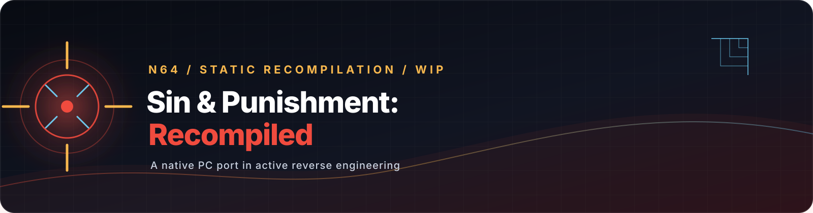

<p align="center">
  
</p>

<p align="center">
  <a href="#project-status"></a>
  <a href="#progress"></a>
  
  
</p>

# Sin &amp; Punishment: Recompiled

An experimental native PC port of Treasure's **Sin &amp; Punishment: Hoshi no Keishousha**
(Nintendo 64, Japanese release, 2000), built with static recompilation rather than a
traditional decompilation.

The project combines [N64Recomp](https://github.com/N64Recomp/N64Recomp),
[N64ModernRuntime](https://github.com/N64Recomp/N64ModernRuntime),
[RT64](https://github.com/rt64/rt64), and
[RecompFrontend](https://github.com/N64Recomp/RecompFrontend) to turn a ROM analysis
and symbol map into a native C++ executable.

## Project status

> [!WARNING]
> This is an active reverse-engineering repository, not a finished release. It does
> not ship a ROM, game assets, or a redistributable playable build. The title screen
> milestone is real; full gameplay, menus, two-player support, enhancement features,
> and release QA are still ahead.

### At a glance

| Area | Current state |
| --- | --- |
| Toolchain | N64Recomp and RSPRecomp build locally; CMake/Ninja tree is wired |
| Reverse engineering | Symbol sections and custom audio microcode have been mapped |
| Runtime | Native window, RT64 presentation, audio callbacks, input callbacks, and overlays are integrated |
| Visual milestone | The game boots to the title screen and continues rendering |
| Playability | Phase 3 validation is in progress; not yet claimed complete |
| Release | No packaged build, ROM distribution, or final QA pass |

## Progress

| Phase | Status | Milestone |
| --- | --- | --- |
| 0 — Toolchain | Complete | Recompiler tools, submodules, scripts, and the CMake tree |
| 1 — Symbols and memory map | Complete | Ghidra-derived symbol data, overlays, and RSP findings |
| 2 — Boot and title screen | Complete | Native executable opens, renders the title screen, and survives the documented long-run checkpoint |
| 3 — Runtime completion | In progress | Menus, input, audio, configuration, and two-player verification |
| 4 — Enhancements | Planned | Widescreen, higher internal resolution, high framerate, and modern aiming |
| 5 — QA and release | Planned | Full playthrough, platform matrix, packaging, and troubleshooting documentation |

### Current checkpoint — 2026-08-09

The latest engineering checkpoint is substantially past the initial scaffold:

- Phases 0–2 are marked complete in [`GOAL.md`](GOAL.md).
- The executable reaches the title screen through the native RT64 path.
- The documented stability run reached **4,577 graphics tasks (about 76 seconds) without a crash**.
- The display pipeline was repaired: the title is presented, `osViBlack(0)` occurs once at boot, and the render loop keeps producing graphics work.
- The custom audio ucode is located and recompiles through RSPRecomp; SDL audio callbacks and tracing are wired.
- The Phase 3 foundation is present: recompinput profiles, controller polling, a mouse-to-stick path, a recompui launcher, graphics/input/audio/mod configuration tabs, and a scripted-input test hook.
- The remaining Phase 3 work is validation and correction, not an empty scaffold: navigate title → mode selection → level 1, verify full audio, persist settings, exercise two controllers, and complete the robustness pass.

The status above is deliberately conservative. Reaching the title screen is not the
same as completing a game, and the project will not call itself playable until the
Phase 3 acceptance criteria are evidenced.

For the reverse-engineering record and the runtime checkpoint details, see
[`docs/research.md`](docs/research.md) and
[`docs/session-handoff-2026-08-09-display-fix.md`](docs/session-handoff-2026-08-09-display-fix.md).

## Architecture

```text
Japanese N64 ROM + symbols
             │
             ├── N64Recomp ────────▶ generated game functions
             ├── RSPRecomp ────────▶ generated custom audio ucode
             └── native display lists ─▶ RT64 graphics backend
                                         │
              N64ModernRuntime + RecompFrontend
                                         │
                         SinPunishmentRecompiled
```

The graphics microcode is handled by RT64's native GBI path in the current runtime;
the generated RSP source is used for the custom audio task. This distinction matters
when reading the generated-output rules below.

## Build the developer tree

The repository contains source, configs, symbol data, scripts, and submodule pins.
ROMs and generated output are intentionally ignored.

### Requirements

- macOS with full Xcode installed (RT64 compiles Metal shaders; Command Line Tools alone are not enough)
- Linux with a Debian-compatible package manager, or Windows with Visual Studio 2022/clang and CMake
- Python 3
- A legally obtained Japanese ROM dump matching the project metadata

### Bootstrap and compile

```bash
git submodule update --init --recursive

# macOS/Linux: installs dependencies and builds N64Recomp + RSPRecomp.
./scripts/bootstrap.sh

# Convert a local V64 dump to the big-endian Z64 form used by the project.
mkdir -p rom
python3 scripts/rom_info.py convert \
  "/path/to/your/japanese-dump.n64" \
  rom/sinpunishment.z64
python3 scripts/rom_info.py info rom/sinpunishment.z64

# Generate the C/C++ recompilation output once the local development working image
# expected by sinpunishment.toml is available.
./scripts/recompile.sh

# Configure and build the native executable.
cmake -B build -G Ninja -DCMAKE_BUILD_TYPE=Release
cmake --build build
```

The clean `rom/sinpunishment.z64` is the runtime ROM identity. The active
reverse-engineering config currently points N64Recomp at
`rom/sinpunishment_patched.z64`, a development working image that is not distributed
by this repository. The patch inventory and the clean/stored ROM distinction are
documented in [`docs/research.md`](docs/research.md). Until that working-image
pipeline is published, a clean clone is an engineering checkout, not a one-command
release build.

### Run the current executable

```bash
# Opens the normal recomp frontend launcher.
./build/SinPunishmentRecompiled

# Developer shortcut: skips the launcher and starts the registered game.
SP_AUTOSTART=1 ./build/SinPunishmentRecompiled
```

Useful development instrumentation:

| Variable | Purpose |
| --- | --- |
| `SNP_TRACE=1` | Logs runtime, audio, and input activity |
| `SNP_AUDIO_DUMP=/tmp/snp_audio.raw` | Dumps queued stereo samples for offline inspection |
| `SP_INPUT_SCRIPT=/path/to/script` | Feeds timed synthetic controller, stick, or mouse-delta input |

These hooks are for development and validation; they are not release UX.

## Repository map

```text
sinpunishment.toml       N64Recomp configuration and patch/stub list
symbols/                  Ghidra-derived function and data symbols
scripts/                  Bootstrap, recompilation, ROM inspection, and post-processing
src/main/                 Native launcher, runtime callbacks, and overlay registration
src/game/                 Game-specific integration (currently being expanded)
rsp/                      RSPRecomp configs; generated .cpp files are ignored
include/                  Port-facing headers and generated interfaces
patches/                  Port patch helpers and UI integration headers
lib/                      Pinned RT64, runtime, and frontend submodules
external/N64Recomp/       Pinned N64Recomp toolchain submodule
docs/research.md          Reverse-engineering source of truth
GOAL.md                   Master roadmap and acceptance criteria
GOAL_FASE3.md             Current runtime-completion work plan
```

## Roadmap

The next meaningful milestone is not a graphics feature. It is a trustworthy
Phase 3 playthrough:

1. Navigate the title screen and mode selection with keyboard and controller.
2. Reach level 1 and verify the complete input path, including aiming.
3. Check title and level audio for continuity, latency, and synchronization.
4. Confirm settings persist across launches and survive runtime option changes.
5. Exercise two-player assignment and a long session before calling the phase done.
6. Only then move to widescreen, resolution, framerate, and release QA.

The full acceptance checklist lives in [`GOAL_FASE3.md`](GOAL_FASE3.md), with the
long-term release criteria in [`GOAL.md`](GOAL.md).

## Research and contribution rules

This project has no public decompilation to build on, so reverse-engineering evidence
is part of the implementation. When working here:

- Read the relevant sections of [`GOAL.md`](GOAL.md) and [`docs/research.md`](docs/research.md) first.
- Record new offsets, behavior, and hypotheses with reproducible evidence.
- Keep commits focused and do not commit ROMs, generated recompilation output, build directories, or local runtime state.
- Treat the pinned submodules as upstream dependencies; changes to them need an explicit reason and a reproducible checkpoint.
- Do not describe the project as playable until the acceptance criteria are met.

## Credits and licensing

This port's original code follows the project's GPL-3.0 licensing intent. The
third-party submodules retain their upstream licenses:

- [N64Recomp — MIT](https://github.com/N64Recomp/N64Recomp)
- [N64ModernRuntime — GPL-3.0](https://github.com/N64Recomp/N64ModernRuntime)
- [RT64 — MIT](https://github.com/rt64/rt64)
- [RecompFrontend — GPL-3.0](https://github.com/N64Recomp/RecompFrontend)

No ROM or proprietary game asset is included. Use only materials you are legally
entitled to use locally; do not open issues or pull requests containing copyrighted
game data.
