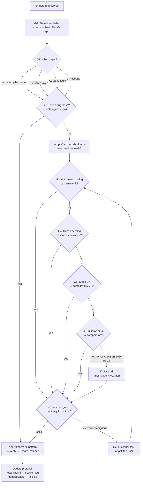

# Diagnostic playbook — Sin & Punishment recomp

> [!IMPORTANT]
> **READ `docs/findings-ledger.md` FIRST — in full, before any investigation.**
> It is ~178 entries and it is the **visited set**: every established fact,
> ruled-out hypothesis, *withdrawn* belief and dead tool, one line each.
>
> *If that count has grown much past 178, or entries have stopped being one
> line each, read **T55** before anything else. The ledger is the INDEX layer
> of this playbook. When it stops being scannable the fix is to move detail
> back down here and leave one line — not to build a second index.*
>
> This file and the journal are 1,700 and 5,000+ lines. Searching them to ask
> "do we already know X?" costs more than re-deriving X, so without the ledger
> the cheap move becomes re-deriving — and the same ground gets covered twice.
> That has happened: the ares comparison and the stub sweep were both re-run
> needlessly. **Skipping the ledger does not save time, it spends it twice.**


**Living document.** This is the decision tree for diagnosing anything wrong
with this build. It is meant to be *followed in order* and *edited as we go*.
See "Update protocol" at the bottom for how it stays current — that part is
not optional, it's the reason this file is worth having.

Companion documents:
- `docs/boot-debugging-2026-08-13.md` — the running session log (what we found,
  pass by pass). **Findings go there. Method goes here.**
- `~/.claude/projects/.../memory/sin_punishment_recomp_status.md` — cross-session
  memory: environment, tool locations, current status.

Both this file and the session log are gitignored (`.gitignore`: `*.md` with
`!README.md` — "development Markdown stays local"). Keep it that way unless we
decide to publish it deliberately.

---

## The map



**Free nodes come before every gate.** `scripts/decomp.sh <func>` (real C for
any ROM function) and reading a capture cost nothing and no run — expand them
before anything that starts a process. A free node left unexpanded while
90-second experiments run is the most common way this ordering gets violated in
practice; it happened on 2026-08-18 and the free read, once taken, immediately
overturned the working theory. **G6 is currently unusable** — see its section.

Ordering principle: **cheapest and least human-attention-consuming first.**
G2 (known bug class) is at the front because empirically it has the highest hit
rate in this project by a wide margin — six of the bugs fixed so far were the
same class, and the sixth took a full live-gdb session that a catalogue lookup
would have short-circuited.

Note this reorders the intuitive list slightly: "is the screenshot definitely
what I want to see?" is **not** a step, it's the evidence gate (EV) that applies
to *every* observation at *every* stage. It was the failure mode twice in one
session, both times at the point of interpreting a result, not at the point of
choosing a tool.

---

## G0 — State the symptom falsifiably

Before touching a tool, write down:

- **Exact observable** — the literal error string, the exit code, the task
  count, the `boot_screen_check.sh` verdict numbers. Not "it's broken".
- **Reproducibility** — N of M runs, and whether the failure point is
  *identical* each time (e.g. "stalls at exactly 123 gfx tasks, 3/3 runs").
  A stable number is itself a strong diagnostic signal; a varying one means
  a race and routes to class B.
- **Last known good** — which commit / which build / before which change.
- **What would falsify my current guess.** Write this before running anything.

If you can't fill these in, you don't have a bug report, you have an
impression. Go get the numbers first — usually `scripts/boot_screen_check.sh`
or a task-count print is enough.

> **From our history:** "the screen changed after I pressed Start" was reported
> as progress. It wasn't — it was the attract-mode demo continuing on its own
> schedule. There was no baseline for "what does the screen do if I press
> *nothing* for the same duration," so the observation had no discriminating
> power. **A change you can't compare against a do-nothing control is not
> evidence.**

---

## G1 — Routing: which layer is this?

The single most decisive question, because it determines which of the two
cross-comparisons downstream is *valid* — using the wrong one wastes a lot of
time and can produce confidently wrong answers.

| Class | What it is | Signature | Useful gates |
|---|---|---|---|
| **A** | **Recompiler output** — N64Recomp mis-translated the MIPS | Build-time errors; `Unhandled branch in static_NN_ADDR`; dangling gotos; a function that's a no-op when the ROM's disassembly says otherwise; control flow that doesn't match the ROM | G2, G4, **G6 (ares)**, G7 |
| **B** | **Runtime layer** — `ultramodern`/`librecomp`/RT64 differs from real hardware | Races; timing-dependent; "worked in ares"; uninitialized-looking reads; scheduler/deadlock; input/VI/DMA behaviour | G2, G4, **G5 (MM/BK)**, G7 |
| **C** | **Game logic / progression** — the N64 code runs correctly but doesn't do what we expect | No crash, no error, just doesn't advance; a branch not taken; a state machine parked | G4, **G6 (ares)**, G7 |
| **D** | **Host / environment** | Fails before the ROM matters; machine-specific; Vulkan/SDL/X11/permissions/packaging | G3, G4 |

**The routing rule that matters most:**
- Reference recomps (MM/BK) share our *exact runtime source*. They are ground
  truth for **class B** and worthless for class C.
- ares shares the *real hardware behaviour of the game*. It is ground truth for
  **class A and C** and worthless for class B (it doesn't run our runtime at
  all).

Getting this backwards is how you end up "proving" something with a comparison
that structurally cannot speak to the question.

If you genuinely can't route it yet, that's fine — say so explicitly, and use
G3 to gather enough to route it. Don't guess a class and then pick a comparison
that confirms it.

---

## G2 — Is this a known bug class?

Check here **first**, every time. Cheap, and historically the highest-yield gate
in this project.

### BC-1 — Populated metadata, unpopulated pointer *(6 instances — our signature bug)*

**Class:** B (runtime layer).

**Mechanism:** `ultramodern` performs PI DMA **synchronously**; real N64
hardware is **asynchronous**. Real game code is written assuming a window in
which a struct's count/metadata field is set but its pointer field isn't yet
(or vice versa) — hardware's interrupt-driven timing closes that window before
anything reads it. Ours doesn't, so a read lands on an uninitialized slot.

**Signature:**
- `SIGSEGV` on a dereference, or `Failed to find function at 0x<garbage>`.
- The bad value is *not* a slightly-corrupted pointer — it's arbitrary
  (`0x3DC7CA55`), i.e. uninitialized stack/heap, not arithmetic gone wrong.
- The surrounding code often *already* guards against the value being exactly
  `0` ("not registered yet") but not against nonzero-garbage. **That existing
  zero-check is the tell**, and it also hands you the fix's control flow for
  free.

**Fix pattern:** validate against valid N64 RAM range before use, and on
failure jump to wherever the existing "not ready" path already goes:

```toml
[[patches.hook]]
func = "boot_func_XXXXXXXX"
before_vram = 0xXXXXXXXX
text = "if ((unsigned int)ctx->rN < 0x80000000u || (unsigned int)ctx->rN >= 0x80800000u) { goto L_<existing_fallback>; }"
```

The bound `0x80000000`–`0x80800000` is the same one `scripts/auto_stub_pass.py`
uses. Reuse it; don't invent a new one.

**Known instances:** `boot_func_80026A54`, `boot_func_800395C8`,
`boot_func_80030448`, `boot_func_800303D4`, `boot_func_8004E640`,
`boot_func_8004DD0C` (×2 sites — function pointer rather than data pointer,
same class).

**Fast confirmation:** get the bad value. If it's arbitrary rather than
near-valid, and there's a nearby `== 0` guard, it's this — apply the fix and
verify rather than root-causing the DMA timing again. We have root-caused this
class six times; the mechanism is settled.

**Standing question (not yet answered):** whether to keep patching per-site or
fix it once centrally in `ultramodern`. Six instances is enough that the
central fix probably now costs less than the next three site fixes. Worth
deciding deliberately rather than by default. See the session log's
"Open strategic question" note.

---

### BC-2 — Symbol-boundary mis-split *(3 instances)*

**Class:** A (recompiler output).

> **Instance 3, and the most damaging so far (2026-08-18): a function declared
> TOO SHORT, which fails completely silently.** `ovlfile02_func_800E4F34` was
> declared `size = 0x14`; the real function runs `0x8C` to the next symbol. The
> generated C simply **stopped after the first call** — no error, no warning, no
> stub, and it compiles and runs. The seven statements that were dropped included
> the call registering the renderer's per-frame reset, so pressing START loaded a
> scene that registered nothing, left stale list counts, and segfaulted one frame
> later in a sort. Fix was one number in `symbols/sinpunishment.syms.toml`.
>
> **Detection, and why it is cheap:** decompile the address with
> `scripts/decomp.sh` and compare against the generated C. A short function whose
> generated body ends mid-logic — especially right after a `jal` — is this bug.
> A sweep for `vram + size < next_vram` across the symbol file finds every
> candidate at once (296 exist; most are genuine data, so triage, don't mass-fix).
>
> **Why it evaded every earlier gate:** the symptom appeared four scene loads
> downstream, in unrelated resident code, as a NULL dereference. Nothing pointed
> at a symbol table. Reaching it took a hardware watchpoint on the affected
> global to name the writer, then a `[reg]` probe to show the registration never
> happened. **Truncated symbols present as missing behaviour, never as an error.**

**Mechanism:** a function branches into the **middle** of a neighbouring,
already-declared function — the shared-tail / switch-statement pattern real
compilers emit. N64Recomp can't express this; it tries to synthesize a
standalone function for the mid-function target and fails on nested or chained
cases.

**Signature:** `Unhandled branch in static_NN_ADDR` at build time, **or**
(nastier, and how it bit us) a silently-generated function that is a **true
no-op** — declares locals, returns immediately — where the ROM's disassembly
clearly has real work. Silent version produces a hang/stall, not an error.

**Fix pattern:** in `symbols/sinpunishment.syms.toml`, merge the two symbols
into one — extend the *earlier* function's declared `size` to cover both, and
delete the now-redundant second declaration.

**Known instances:** `ovlfile22_func_800E4780` (`0x40` → `0x20C`, removed
`ovlfile22_func_800E47C0`); `ovlfile01_func_800E4780` (`0x40` → `0xF8`, removed
`ovlfile01_func_800E47C0`, kept `ovlfile01_func_800E4878`).

**Fast confirmation:** disassemble the address range in ares (or against the
ROM directly) and compare against the generated C. A generated function whose
body doesn't match the ROM's instruction count is this.

---

### BC-3 — Call-free spin-wait deadlock *(2 instances)*

**Class:** B.

**Mechanism:** `while (*addr == 0);` with **zero OS calls in the loop body**.
Real hardware preempts via interrupt. `ultramodern` only delivers messages and
reschedules from inside a game thread's own OS calls
(`osSendMesg`/`osRecvMesg`/`osSetThreadPri`/…), so a call-free spin can never
be broken out of.

**Signature:** hang at 100% CPU on one core, no crash, no progress.

**Fix pattern:** `[[patches.hook]]` in the loop body calling
`ultramodern::yield_self_1ms()` (already in the runtime for exactly this).

**Known instances:** `boot_func_80025CA4`, `boot_func_8004D7B0`.

**Scope note:** a codebase-wide scan for this shape (whole function body is a
single backward-branching `MEM_*` poll, no calls) found exactly these two. A
third would most likely show up in gameplay code — same fix.

---

### BC-4 — Unsymbolized Yay0 overlay *(0 confirmed, 1 predicted)*

**Class:** A.

**Mechanism:** a third overlay system distinct from the 27 known `ovlfileNN`
files — 73 boundary markers (72 files) starting at ROM `0x7C8680`, Yay0-
compressed, **zero symbol coverage**.

**Signature:** `Failed to find function` at an address that traces back to one
of those compressed loads (and *not* to the `0x800E4780` shared window, which
is already handled).

**Fix:** not a quick patch — needs a Yay0 decoder plus fresh boundary analysis
on the decompressed output. Comparable in scope to the original 27-file
archaeology. **Do it deliberately as a project, not as a fix in the middle of
another investigation.**

---

## G3 — Can automated tooling answer this?

Check what already exists before writing anything new. **Do not add fresh
instrumentation until you've confirmed an existing hook doesn't cover it** —
several already do.

### G3.0 — First, check you can READ the whole call chain (T43)

Before investigating any backtrace or call chain, run `decomp.sh` over **every
frame at once**:

```bash
scripts/decomp.sh boot_func_80033758 boot_func_80033A40 main_func_800B09EC ...
```

It ends with `coverage: N readable, M NOT FOUND`. **An unreadable frame is the
first finding, not an obstacle to hand-read around.** It means splat has no
segment covering that address (L6); fix the config in the **sibling** repo
`splat-project` (T19), re-run, and verify per T42.

This exists because on 2026-08-19 an A99 investigation hand-read the
transliterated C in `RecompiledFuncs/`, stopped at "the node is arg0", and never
asked whether the *caller* was readable. It was not — and the fix was already
sitting in the schedule labelled as tooling rather than as a dependency of the
frontier. One run of the command above would have said so in seconds.

**Reading generated C by hand is the last resort, not the first move.** That is
what `decomp.sh` is for; a hand-read of `boot_func_8002AA90` on 2026-08-18
truncated and missed an entire list that m2c emitted in six lines.

### G3.1 — Overlay data: ALWAYS list every copy before quoting a value (added 2026-08-19)

**One command, before you quote any value at a `0x802C`–`0x802E` address:**

```bash
grep -l '802CE128' /home/joh/Documents/sin_and_punishment/splat-project/asm/*.s
```

If more than one file defines it, **the value is overlay-dependent** and a
single reading of it means nothing on its own. Quote all of them, or say which
overlay you read.

**Why this is here rather than in anyone's memory.** This is A85's trap and it
has now caught us twice. On 2026-08-19 (A110) the check was run on
`D_802E1680`, came back with a single definition, and was reported clear. One
dereference later (A114) the same reasoning quoted a buffer as
"`.word 0x00000000` in the ROM image, verified by direct lookup" — and that
address is defined in **three** overlays, `0x00000000` in one and real float
data in the other two (A119). The lookup was correct. The scope was not.

**Having cleared the trap once is exactly what makes the second instance
likely** — the check felt spent. It costs one command; run it every time.

### G3.2 — Read the ROM directly with the MIPS toolchain (added 2026-08-19)

`binutils-mips-linux-gnu` is installed. Use it whenever you would otherwise
compute a ROM offset by hand, and to check splat rather than trusting it.

```bash
mips-linux-gnu-objdump -D -b binary -m mips:4300 -EB \
  --adjust-vma=0x80024C00 --start-address=0x800339C8 --stop-address=0x800339F4 \
  /home/joh/Documents/sin_and_punishment/splat-project/baserom.z64
```

* `--adjust-vma` is the vram→ROM delta **as an explicit argument**. That is the
  point: T49 derived a delta from one misread anchor and produced a clean,
  plausible, entirely wrong dispatch table. Here a wrong delta shows up
  immediately as instructions that do not match a known symbol.
* **The delta is per segment, not global.** `0x80024C00` is right for the boot
  segment (`asm/1050.s`); overlays have their own. Get it from the `[[section]]`
  `rom`/`vram` pair in `symbols/sinpunishment.syms.toml`, and T49's two-anchor
  rule still applies to choosing it.
* Validated on adoption (T61): the command above reproduces splat's
  `asm/1050.s` instruction-for-instruction with identical encodings. **Re-run
  that comparison if you ever doubt the invocation** — it is a positive control
  on tool, arguments and splat together.
* `mips-linux-gnu-nm` is also available for the ELF side.

### Environment hooks already built into the build

| Hook | What it does |
|---|---|
| `SP_AUTOSTART=1` | Skip the launcher, boot straight into the ROM |
| `SNP_TRACE=1` | Enables diagnostic prints already scattered through the codebase (input via `maybe_log_input`, audio via `queue_samples`, …) |
| `SP_INPUT_SCRIPT=<file>` | Timed synthetic input: `t=<sec> keydown\|keyup <BUTTON>`, or `stick <x> <y>`. Feeds the same path real input takes |
| `SNP_AUDIO_DUMP=<file>` | Audio capture |

### Scripts

| Script | Question it answers |
|---|---|
| `scripts/boot_screen_check.sh <sec> <out.png>` | "Is the screen black?" — launches, screenshots the *game window* (`xwininfo`+`xwd`+`ffmpeg`), gives a numeric dark-fraction verdict. Window-selection fixed 2026-08-14 to require WM_CLASS `SinPunishmentRecompiled` and exclude `mutter` — it used to match the WM's own decoration/frame window too (same title text) and could silently capture that instead. Check the printed image `size=`: `(1280, 720)` is the real content window; anything else means the wrong window was captured. **A "BLACK" result is no longer trustworthy on its own — see the standing rule below.** |
| `scripts/gdb_watch.sh <vram> [arm] [deadline] [log] [bin] [cond]` | Hardware watchpoint on an N64 address — breaks at `recomp_entrypoint`, captures rdram base, computes the host address. **`[cond]` is appended to the `watch` (e.g. `"== 0x02000000"`) — use it or a hot word floods the watchpoint.** Its arm-time print of the current value is the positive control: if the value is already what you are hunting, you armed too late and a null result would be meaningless |
| `scripts/gdb_fault.sh [deadline] [log] [bin]` | Catches the SIGSEGV and dumps the game-side register file. **Run it against `build-debug/` — `ctx` needs debug info; against `build/` you get frame names only.** There is no core file to inspect instead: `ulimit -c` is 0 and apport owns `core_pattern`, so bash's "(core dumped)" is the signal disposition, not a file |
| `scripts/display_isolate.sh` | Sourced by the three launchers, never run directly. `xvfb` (default, truly headless) / `SNP_ISO=xephyr` (nested — input isolated but **a window IS shown**) / `SNP_VISIBLE=1` (real display, your typing reaches the game — T23). One copy on purpose: three divergent copies is what let the gdb wrappers run unisolated (T59) |
| `scripts/xtest_key.py <win_hex> <keysym>…` | Real synthetic keyboard input to an SDL/X11 window. Clicks into the window first (WM click-to-focus) then `xtest.fake_input`. Works against our build *and* the reference recomps |
| `scripts/xclick.py <win_hex> <x> <y>` | Real synthetic click at a specific point in an X11 window. Reliable against top-level SDL/game-render windows (ours, BanjoRecomp, ares' main window); **not** reliable against native Qt dropdown menus — ask the user to drive those directly instead |
| `scripts/strip_scratch_hooks.sh` | Removes the scratch-debug-hook block from `sinpunishment.toml` between its BEGIN/END markers — **run before committing** |
| `scripts/run_game.sh <sec> <log> [ENV=v…]` | **The only correct way to run the game from tooling.** Kills by PID with SIGKILL and reports `leftover=N`. Plain `timeout` does *not* work (SDL2 catches SIGTERM) and `pkill -f` kills its own shell — see the two rules under G3 |
| `scripts/auto_stub_pass.py`, `auto_label_fix.py`, `fix_dangling_gotos.py`, `fix_zero_writes.py`, `patch_si_stubs.py` | Bulk recompiler-output repairs (class A) |
| `scripts/rom_info.py` | ROM identification / conversion |
| `scripts/rom_disasm.py <vram> [end\|+len]` | Disassemble the ROM at a VRAM address. **Looks the vram->ROM delta up from the `[[section]]` blocks rather than taking it as an argument** — deriving it by hand is what produced T49's confident wrong table. REFUSES if no section contains the address, and warns when several do (overlays share vram — A85/G3.1). `--self-check` compares against splat's committed asm: a positive control on tool, invocation and delta at once |
| `scripts/rr_record.sh` | **Refuses by default — `rr` cannot record this target (G7.1/T62).** Kept for a future `rr` version; `SNP_RR_FORCE=1` overrides |

### Standard loop

```bash
./scripts/build.sh          # NOT recompile.sh + cmake directly:
                            # build.sh lints the probes first and snapshots the
                            # binary it is about to overwrite (T25/T26)
./scripts/boot_screen_check.sh 60 /tmp/check.png
```

### Wayland/xwd capture unreliability — root-caused and fixed, 2026-08-14

**`xwd`-based capture could *intermittently* report solid black for a window
that was genuinely rendering correctly** — not consistently broken, which is
what made it dangerous. This machine's desktop session is Wayland
(`$XDG_SESSION_TYPE=wayland`); `xwd`'s traditional X11 `XGetImage` capture
reads a window's legacy X11 backing store, and this game's Vulkan swapchain
presentation (`SDL_WINDOW_VULKAN` + RT64) doesn't reliably keep that backing
store updated under XWayland. Caught by contradiction: `nvidia-smi` showed
the game actively rendering (GPU memory + compute in use) while every
capture insisted the screen was black; resolved by asking the user to look
directly, which showed it was fine the whole time.

**Actually fixed, not just worked around**: `SDL_VIDEODRIVER=x11` forces a
native X11 window instead of a Wayland-native one, which sidesteps the whole
XWayland/Vulkan interaction. Verified with three consecutive captures in a
row, all correct — this was the intermittent failure's real cause, not a
coincidence of timing. `scripts/boot_screen_check.sh` now sets this by
default. **This specific tool no longer needs the black-result caution below
applied to it** — but the underlying mechanism (Wayland + Vulkan + `xwd` is
an unreliable combination) is still true for *any other* ad hoc capture on
this machine that doesn't force the same driver, so the general rule stays.

**A second, related fix while making the game run out of the user's way**:
the user asked whether test runs could avoid depending on their own screen
at all — not just capture-reliably, but not visibly interrupt them either.
True headless rendering isn't available here (Xvfb + software Vulkan aren't
installed, need `apt`+sudo). What worked instead: standard ICCCM iconify
(`WM_CHANGE_STATE` → `IconicState` via a `ClientMessage`, not a plain move —
GNOME/mutter clamps windows back on-screen if you try `configure(x=-3000,
...)`, and ignores `_NET_WM_DESKTOP` requests for workspaces that don't
exist under its dynamic-workspace model). New script:
`scripts/minimize_window.py`. The game keeps rendering and stays fully
capturable via `xwd` while minimized — confirmed with a capture taken 45s in,
well after the window had left the user's view, showing the attract-mode
subtitle text had genuinely advanced between runs (a live, progressing
capture, not a stale one).

**One real pitfall integrating the two, worth remembering for any
similar window-automation task**: minimizing a window *immediately* at
creation — before its first successful frame present — can leave it stuck
never rendering for the rest of the run. Confirmed reproducible twice.
Minimizing only works reliably once the window has actually presented a real
frame. `boot_screen_check.sh` handles this by polling with quick throwaway
`xwd` captures (every 0.25s) until the first non-black one shows up, then
minimizes immediately — self-calibrating to the real first-present timing
rather than guessing a fixed delay, which would otherwise be either too
conservative (window stays visible longer than it needs to) or too tight and
flaky under system load. A fixed 8s delay was tried first and worked, but
the user reasonably wanted the window visible for less time than that when
it isn't necessary — the polling version minimizes as soon as it's safe,
observed at roughly 1-3s in practice, without needing to know or tune that
number.

`boot_screen_check.sh` minimizes by default now; set `KEEP_VISIBLE=1` to skip
it when a human actually needs to look at the live window.

### Liveness is measured with `SNP_HEARTBEAT=1`, never by diffing screenshots

**Do not judge "is the game still running?" from frame-to-frame screenshot
differences.** `boot_screen_check.sh` and `freeze_check.sh` both *minimize* the
window before capturing, and `xwd` on a minimized window does not reliably
reflect what is being drawn. Differences between consecutive captures there are
capture noise, not animation.

This produced confident wrong answers in **both** directions on 2026-08-15/17 —
"still animating at 100s" and "freezes at 40-55s" — and a 5-run survey reporting
`ANIMATING 5/5` for a build the user was watching sit frozen. The user caught it
every time; the tooling never did.

**Use the heartbeat instead:**

```bash
SP_AUTOSTART=1 SNP_HEARTBEAT=1 ./build/SinPunishmentRecompiled
```

It counts display lists the *game* submits (`submit_rsp_task`, `M_GFXTASK`) and
reports once a second from a sampling thread — so it still prints when
submissions stop, which is the interesting event:

```
[heartbeat] t=42s gfx_tasks=1240  +29
[heartbeat] t=43s gfx_tasks=1240  +0  <<< NO GFX TASKS (1s stalled)
```

Produced by game logic, independent of any window, compositor or capture path.
It agreed with direct human observation immediately where screenshot diffing had
failed repeatedly. Screenshots remain fine for *what* is on screen; they are not
evidence of *whether the game is running*.

**Corollary — never compare readings across separate runs.** Each
`boot_screen_check.sh` invocation launches a fresh process. Comparing its output
at 50s, 70s and 100s compares three independent runs, which measures run-to-run
variation, not whether one run is progressing. This game's boot is genuinely
nondeterministic (freeze / run-long / silent exit / never-render all occur from
one binary), so **any claim from a single run is unfounded by construction** —
use `scripts/freeze_survey.sh` for outcome rates.

### General rule: a "BLACK" verdict from an unfamiliar capture method is not trustworthy on its own

The specific tool above is fixed, but the underlying lesson generalizes to
*any* future screen-capture need on this machine that isn't already going
through the fixed path: before concluding a build is broken from a black
screenshot, get at least one independent, non-visual signal first. In order
of preference:
1. **Ask the user to look directly at their screen.** Fastest, most reliable,
   zero setup. Use this first, not last, when a screenshot alone is the only
   evidence of a problem.
2. **A stderr trace/probe signal** (`SNP_TRACE=1`, or a temporary probe like
   the gfx-task-submission counter used this session) — proves real
   game-logic/renderer activity independent of any capture method.
3. **A live gdb thread-state check (G7)** — proves threads are or aren't
   actually stuck, independent of any capture method.

A black `xwd` capture is only usable as *corroborating* evidence once one of
these confirms the same conclusion, never as the sole basis for "this build
regressed." This upgrades — doesn't replace — the three-band ambiguous
threshold from `EV` rule 1: that handles genuinely borderline pixel
statistics; this handles the capture method being *confidently wrong*.

### Never put `pkill -f <binary>` in the same command line as the run

`pkill -f` matches against **full command lines** — including the command line
of the shell that is running the `pkill`. So this self-destructs:

```bash
pkill -f SinPunishmentRecompiled; sleep 1; timeout 10 ./build/SinPunishmentRecompiled   # kills its own shell
```

It fails **silently and misleadingly**: the run returns `Exit code 144` with
*zero* output — no game output, and not even output from `echo` statements
earlier in the same line. On 2026-08-15 this was misread as "the game hangs
before initialisation" across an entire debugging stretch, while the game was
in fact segfaulting in ~1s. It simultaneously produced a "can't close the game
window" symptom, because the pkill never reached the real process.

**The `[R]` bracket trick is NOT a sufficient fix.** It stops the *pattern*
from matching its own argv, but the same command line usually also contains
the binary path in plain form (`./build/SinPunishmentRecompiled` on the
`timeout` line) — and `pkill -f` matches *that*, killing the shell anyway.
Recorded because it was tried as the fix in this session and failed exactly
this way, producing another round of silent no-output runs.

**Use `scripts/run_game.sh`.** It kills **by PID**, never by name pattern,
which is the only form that cannot self-match:

```bash
scripts/run_game.sh 20 /tmp/run.log SNP_TRACE=1
```

It prints `leftover=N` so a failure to die is visible rather than silent.

Generalised rule: **a test command that returns no output at all has not
proved anything about the program.** Before concluding "it hangs", confirm the
harness itself survived — put an `echo` at the end of the line and check that
it printed. This is the `EV`-gate discipline applied to the harness rather
than to the program.

### `timeout N` does not kill this game — SDL2 eats the SIGTERM (root-caused)

This was previously recorded under G7 as observed-but-not-root-caused ("two
`timeout 20` runs were both still alive ~1h45m later"). The cause:

**SDL2 installs its own `SIGINT`/`SIGTERM` handlers by default** and converts
them into an `SDL_QUIT` *event* rather than terminating. `SDL_HINT_NO_SIGNAL_HANDLERS`
is not set in `src/main/main.cpp`. So `timeout N` politely *asks* the game to
quit — and while debugging, the game thread is usually blocked and never
processes the event. The process survives indefinitely, the window stays up,
and the WM eventually shows the user a **"application is not responding /
force quit"** dialog. That dialog is a symptom of this bug, not of the game.

Measured this session, same binary, same build:

| kill method | result |
|---|---|
| `timeout 12` (SIGTERM) | **still alive at 120s** |
| `kill -9` by PID (`scripts/run_game.sh 12`) | dead at 12s, `leftover=0` |

**Never use plain `timeout` on the game.** Use `scripts/run_game.sh`, or
`timeout -s KILL` if invoking directly. SIGKILL cannot be caught by SDL or
anything else.

### Never "fix" a bug by editing `RecompiledFuncs/`

`RecompiledFuncs/` is **gitignored, untracked, and regenerated from scratch by
every `recompile.sh` run.** An edit there is invisible to `git status`, cannot
be reviewed or committed, and evaporates on the next recompile — so a "fix"
that lives there will appear to work and then silently vanish, and any later
session will be unable to see why behaviour changed.

Worse, the generated C is a faithful transcription of the ROM. If it does
`sw $zero, ...` then the ROM zeroes that word, and overwriting that with a
hand-picked value is **fabricating behaviour the game does not have** — it
does not fix the reason the real writer never ran. On 2026-08-15 a callback
slot was force-populated this way; it made the callback fire, and the
resulting segfault was then chased as if it were a separate bug.

Probes and `#include <stdio.h>` in generated files are fine (they're
observational, and reapplied per the note below). *Semantic* changes are not:
they belong in `sinpunishment.toml` patches, the symbol map, or the runtime.
If a function never runs, find its real caller — see **G4**'s "Tracing
indirect calls (function-pointer tables in ROM data)".

### A note on scratch hooks

Temporary `[[patches.hook]]` entries go between the BEGIN/END markers in
`sinpunishment.toml` and get stripped by `strip_scratch_hooks.sh`. Instrument
freely, but **revert instrumentation in submodules by hand**
(`git checkout -- <path>`) — the strip script doesn't touch those, and a stray
`printf` in `lib/N64ModernRuntime` will silently ride along into a commit.

**A `fprintf`/`stderr` scratch hook needs `#include <stdio.h>` added by hand.**
The generated `RecompiledFuncs/funcs_N.c` files don't include it by default,
so a hook text using `fprintf(stderr, ...)` fails to compile
(`'stderr' undeclared`) the first time. `scripts/ensure_stdio.py` already
exists for this but only fires on files containing the literal string
`"[flag]"` (an older, different debug-print convention) — it won't catch a
differently-tagged probe. Either match that exact tag, or just manually
prepend the include to the affected generated file(s) after `recompile.sh`
and before `cmake --build` (fine for a one-off — `RecompiledFuncs/` is
gitignored and regenerated every time anyway).

### A probe set ships with its controls, or it costs a second build (added 2026-08-18)

`recompile.sh` + `cmake --build` is ~3 minutes, and a probe run that must reach
frame 992 is another **5 minutes**. So a probe that has to be revised because it
lacked a control costs roughly one working cycle, every time.

On 2026-08-18 three cycles were spent on one question and **one was pure
waste**: the first probe set had ARM lines but no *heartbeat*, so a 60s run came
back completely silent. That silence was unreadable — a true negative and a
probe that never reached its frame gate look identical (T16, and defect class
I1). The second cycle added four characters' worth of heartbeat and nothing
else.

**Before building, every probe set gets all four:**

1. **ARM line** — one print on first execution. Proves the probe is live.
2. **Heartbeat** — a periodic print of the gating variable (frame counter),
   from at least one probe. Proves the gate was *reached*, which is a different
   claim from "the probe ran".
3. **`static _Thread_local`** on all probe state (I4/I5/I8 — three defects of
   this one class).
4. **A run length that reaches the gate.** ~300s to pass frame 1024 here. The
   habitual 20-45s run does not get there, and its silence means nothing.

Batch every probe you can foresee needing into **one** hook set. Hooks are
cheap per-probe and expensive per-build: 14 probes cost the same as 1.

### The audit ladder (added 2026-08-18)

26 of 170 ledger entries were withdrawn in one session, and in-the-moment
discipline caught almost none of them. What caught them: the user spotting two,
random EXPLORE rolls landing on stale items, and one audit. So review is the
mechanism that works here — but only if it is cheap enough to actually happen.

**The rule that keeps it cheap: each level reads the level below's OUTPUT, never
the raw data.** Nothing ever trawls the journal.

| level | when | reads | output |
|---|---|---|---|
| L0 | every checkpoint | — | `check_ledger.py` hook + `route.py` roll |
| **L1** | every ~10 rolls | ledger table, `run-log.tsv`, `route-log.md`, git | `scripts/audit.py` -> `docs/audit-log.md`, <=15 lines |
| **L2** | daily | **only the L1 blocks** in `audit-log.md` | group defects by class; did the fix for class X hold?; list the day's load-bearing claims + falsifiers for the user to scan |
| L3 | weekly | **only the L2 blocks** | is the withdrawal rate falling? which classes recur despite tooling? |

`audit.py` checks **leading indicators**, never findings themselves —
re-verifying a claim costs what producing it cost, and an audit that expensive
gets skipped. Each check maps to a failure that really happened: single-run
claims (T22), probes with no control (I1, I13), entries created and withdrawn
in one window (I14), explore ratio below eps (T14), missing evidence (the
A24/B35 dangling-citation class), contaminated runs (T23).

**Kill criterion, so this cannot become theatre:** three consecutive quiet
audits -> halve the frequency. Two quiet L2s -> drop to weekly. An audit that
never fires is a cost, not a control. `audit.py` tracks the quiet streak itself.

**Known limit.** Mechanical checks catch structure, not "this claim is broader
than its evidence" unless it leaves a trace — and both errors the user caught
were of exactly that kind. L2's real product is therefore a digest short enough
for the user to scan in 30 seconds, not a verdict from the same judgement that
made the error.

### Reverting a multi-file change: revert every piece together, not one at a time

**A real bug, caught by the user watching directly, not by any tooling**:
reverted `sinpunishment.toml` back to committed state but forgot
`scripts/patch_si_stubs.py` and the `cont.cpp` submodule change, which were
still holding the *other*, SI-fix version. The result wasn't "old state" or
"new state" — it was a **third, untested, broken combination**
(`sinpunishment.toml` said two functions should be empty stubs;
`patch_si_stubs.py` no longer knew to inject a return value into them, since
its list had also changed). Produced a real black screen that looked exactly
like a genuine regression.

**When a fix spans multiple files that depend on each other's exact content
(here: a TOML stub list + a Python post-processor that reads the same
function names + a C++ source addition), revert all of them in the same
step, then verify each one individually — not just the one that comes to
mind first.** `diff`/`git diff` every file that was part of the original
change, not just the most obviously-changed one. A partial revert can be
harder to diagnose than either full state, because it doesn't match either
of the two things you've already characterized.

### Where captures live (added 2026-08-18)

Screenshots do **not** stay in the scratchpad. One ares session at 2s sampling
produced 106 PNGs plus 14MB of `.xwd` intermediates, on a root filesystem at 92%.

- **Keep** the handful of frames that are *reference behaviour* — what the real
  game does — in `/media/joh/extra/sin-punishment-archive/reference-captures/`,
  with a README naming each. That set is 308KB and re-deriving it costs a whole
  ares session.
- **Delete** every `.xwd` intermediate (~700KB each, regenerable in one command)
  and every frame that only re-confirms what a kept frame already shows.
- **Never** leave a copied binary in the scratchpad. `build.sh` snapshots builds
  to the archive drive, so a stray `cur.bin` is 23MB of pure duplication.

### Caching a known-good build for fast comparison

**Snapshot on every state you might want to A/B later, not only on milestones
(added 2026-08-18).** The rule above says "milestone", and following it that
literally cost a control: on 2026-08-18 several builds ran healthy for 90s at
`+30/s`, later builds stalled at t~20s (A86), and by then **every healthy binary
had been overwritten by the next `cmake --build`** — so "is it the build or the
environment?" became unanswerable. An older cached binary was no substitute: it
predated the heartbeat probe, so it had no comparable liveness signal at all.

Cheap rule: before a build that changes anything you might want to compare
against, copy `build/SinPunishmentRecompiled`, `sinpunishment.toml` **and**
`symbols/sinpunishment.syms.toml` into `known_good_builds/` with a dated name.
~24MB each, the directory is gitignored, and a snapshot is far cheaper than
re-deriving a lost baseline. Name non-milestones `DIAGNOSTIC` so the label never
implies a verified state — a milestone still requires the user confirming on
screen.

**A cached binary is only a control if it carries the same instruments.**
Snapshot the probe set with it, or the comparison it was kept for cannot be
made.

`known_good_builds/` (gitignored) holds verified-working binaries + their
matching `sinpunishment.toml`, so comparing current behavior against a known
baseline doesn't require a full `recompile.sh` + `cmake --build` cycle each
time — copy the cached binary into `build/` directly. Worth refreshing
whenever a new, verified-stable milestone is reached (e.g. after confirming
via `boot_screen_check.sh` + direct viewing that a build is genuinely
healthy) — cheap to do at that point, saves a full rebuild later whenever
that baseline is needed again for an A/B comparison (e.g. "does the known-good
build's thread state look the same as the one I'm debugging").

---

## G4 — Can documentation or an existing resource answer this?

Cheaper than any experiment. Check in this order:

0. **`scripts/decomp.sh <func>` — decompile the ROM function and read it.**
   Added 2026-08-18 and now the FIRST thing to try for any "what does this
   function actually do?" question. It runs m2c over splat's per-function
   assembly and emits real C. `boot_func_8002AA90` came out as six lines:

   ```c
   void func_8002AA90(void) {
       D_80067D98 -= D_80067D9C * 4;
       D_80067DA0 -= D_80067DA4 * 4;
       D_80067DA8 -= D_80067DAC * 4;
       func_8002AA3C(&D_80067CA0);
       D_80067DB4 -= D_80067DB8 * 0x10;
   }
   ```

   The same function took a hand-read of ~60 lines of `ctx->r2 = SUB32(...)` in
   `RecompiledFuncs/` to reach the same conclusion — and that hand-read stopped
   early and **missed the fourth list entirely**. Needs no MIPS toolchain (there
   is none installed, and none is required) and no ROM access.

1. **`docs/boot-debugging-2026-08-13.md`** — 25+ passes of findings, including
   several explicitly-recorded dead ends. Re-reading this has repeatedly been
   cheaper than re-deriving.
2. **Our own runtime source** — `lib/N64ModernRuntime` (`ultramodern`,
   `librecomp`), `external/N64Recomp`, RecompFrontend (`recompui`,
   `recompinput`). For class B questions the answer is usually *readable* and
   doesn't need an experiment at all.
3. **`n64decomp/libreultra`** — full libultra decomp. Ground truth for what an
   `os*` call is actually supposed to do.
4. **n64brew.dev wiki** — hardware behaviour (PI/SI/VI/DP timing, memory map).
5. **Upstream repo** — `maximilianoide/sin-punishment-recompiled`: commits and
   open issues. (As of last check: no issues, no commits past `8c31a07`.)
6. **The reference projects' repos** — Zelda64Recomp and BanjoRecomp have both
   solved problems we haven't. Their commit history is searchable prior art.

7. **GameShark cheat codes** (libretro-database has a `(J)` set for this ROM).
   An underrated symbol source: N64 cheat addresses are **KSEG0 virtual
   addresses**, the same `0x80xxxxxx` space `SNP_WATCH` takes, so they are
   usable verbatim with no translation. Confirmed useful:

   | address | meaning |
   |---|---|
   | `0x80075DD6` / `DD8` / `DDC` | unlocked levels / option-menu items / credits — i.e. the **save+options block**, which also contains the `0x80075DCC` gate byte we had already probed anonymously |
   | `0x800D5A9B` / `0x800D5A97` | energy / time, fixed across all levels — a ready-made "are we actually in a level yet?" signal |
   | per-level player struct | varies wildly by level (`0x8010BB2B` in 0-0, `0x801657FB` in 1-1), so the player object is heap-allocated after level load |

   Also tells us a **level "0-0" exists before 1-1** (the tutorial), so the
   transition START triggers is attract → 0-0.

> **Standing principle** (see the `check_for_existing_resources_first` memory):
> search for an existing decomp/doc/tool before deep manual reverse-engineering.
> This project's symbol map exists because someone else did that work already.

> **Negative result, recorded so it is not re-searched** (2026-08-18): there is
> **no public Sin & Punishment decompilation or symbol map**. Nothing on GitHub
> or under `n64decomp` — only translation patches and cheat files. The manual RE
> here is not duplicating anyone's work. Translation patches are *not* worth
> mining: they produce a modified ROM with a different checksum (so our symbol
> map would not apply), and what they reverse-engineer is text pointer tables
> and font routines, nothing on the render or scheduling paths.

### Tracing indirect calls (function-pointer tables in ROM data)

If a function has no caller anywhere in the generated C (checked via grep,
including split `lui`/`addiu` forms for the address), it's likely invoked
indirectly through a function-pointer table sitting in ROM *data*, which
N64Recomp has no way to know is code-shaped and so never disassembles or
cross-references. Confirmed working recipe: search the raw ROM bytes
directly for the target address(es) as big-endian 4-byte words —

```python
rom = open("rom/sinpunishment.z64", "rb").read()
rom.find(bytes.fromhex("8004C680"))  # -> ROM offset, if present
```

A real hit is usually part of a small contiguous array (one entry per
item — e.g. one per controller port); dump a few words either side to find
the table's actual boundaries.

**Converting the ROM offset to a VRAM address: use the segment table's own
documented mapping, never back-compute it from matching a short instruction
sequence.** `symbols/sinpunishment.syms.toml`'s header comment gives the real
mapping per segment (e.g. `.boot`: ROM `0x1000` → RAM `0x80025C00`) — add the
same delta to your ROM offset. **Do not** calibrate the delta by finding a
known function's own opcode bytes in the ROM and computing
`vram - found_offset`, unless you've first confirmed that byte sequence is
unique across the whole ROM. A 3-instruction function prologue
(`addiu sp,sp,-N; sw ra,...; sw s0,...`) is common enough to occur hundreds
of times — the naive version of this silently picked a wrong occurrence and
produced a confidently wrong address. Caught only by checking the match count
before trusting it (which the segment-table approach makes unnecessary in the
first place).

**Static tracing has a hard ceiling at a `LOOKUP_FUNC(ctx->rN)(rdram, ctx)`
call site: the actual target is only known at runtime.** Grepping every
static reference to a data table (as above) finds what a dispatcher *can*
call, not what it *does* call on a given run — a live gdb backtrace through
an active `LOOKUP_FUNC` call shows the real target directly in the frame
(`#N boot_func_XXXXXXXX ()` right below the `LOOKUP_FUNC` frame). This is
exactly the kind of thing that's cheap to verify with G7 and expensive to
fully rule out with G4 alone: a whole indirect-call chain
(`boot_func_8004EAD0` → `boot_func_8004D428` → `boot_func_8003D750` →
`boot_func_8003D5B0`) was completely invisible to every static search this
project ran, because the dispatcher's only static reference to any of it was
the generic `LOOKUP_FUNC(ctx->r2)(...)` pattern — the real target only showed
up once something was actually running under gdb.

---

## G5 — Cross-compare with a reference recomp (MM / BK)

**Valid for class B only.** These share our *exact* runtime source
(`lib/N64ModernRuntime`, RT64, RecompFrontend), so "does this happen there
too?" cleanly separates "our game's bug" from "how this runtime works."

**Invalid for class C.** They tell you nothing about what Sin & Punishment's own
code should do.

**Locations:** `/home/joh/Documents/reference-recomps/{BanjoRecomp,Zelda64Recomp}`,
both built (`build-cmake/BanjoRecompiled`, `build-cmake/Zelda64Recompiled`).
Setup details, ROM hashes, and decompression steps are in the
`sin_punishment_recomp_status` memory.

**Procedure:**
1. Make the identical change/instrumentation in the reference project's copy of
   the shared file (e.g. `lib/N64ModernRuntime/librecomp/src/cont.cpp`).
2. Reach a state in the reference game that is **unambiguously** the state you
   need — see the trap below.
3. Compare. Then **revert the instrumentation** (`git checkout --`).

**The trap, and it caught us:** both reference games open with long
non-interactive intros/attract sequences that *look exactly like gameplay* in a
screenshot. Clock Town and a Mumbo Jumbo conversation both read as "the game is
being played" and neither was. **A screenshot cannot distinguish autoplay from
interactive control.** To establish that a reference build is genuinely taking
input, you need an input→specific-response test: send a key with
`scripts/xtest_key.py`, at a screen where the expected response is unique and
gameplay-only (BK's save-file-select "PRESS A TO PLAY THE GAME" was the one
that worked — selecting an empty slot is unambiguously game logic, not a
`recompui` overlay action). Enter/Start is a **bad** choice: `GameInput::START`
and `GameInput::ACCEPT_MENU` share a default binding, so a response is
ambiguous between the game and the frontend.

---

## G6 — Cross-compare with ares

> [!CAUTION]
> **G6 IS CURRENTLY UNUSABLE — 2026-08-18.** ares stops executing as soon as gdb
> attaches, and keeps reporting readable RDRAM, so a poll returns a full,
> plausible, completely static set of samples. Measured: 43 polls over 86s, a
> 64-word block of thread 3's *active stack* unchanged in every one, `$pc` =
> `0xffffffff` throughout, and a `0xDEADBEEF` canary planted into a live
> function pointer surviving the whole run. **Every prior ares result is void**,
> including the one that attributed the attract-mode stack overflow to us rather
> than to the game. `scripts/ares_watch.sh` now prints an explicit
> `CONTROL FAILED` verdict instead of a clean-looking table. Fix the resume path
> before using this gate again — see `docs/boot-debugging-2026-08-13.md`,
> 2026-08-18.

**Valid for class A and C** — ares is hardware-accurate, so it's ground truth
for *what the real game does*. Use it to answer "what is supposed to happen
here?" and "does the real code path look like our generated code?"

**Invalid for class B** — ares doesn't run our runtime, so it cannot speak to
runtime-layer differences.

Installed user-level via Flatpak (`dev.ares.ares`). With a real GDB remote
serial protocol debug server:

```bash
flatpak run dev.ares.ares --setting DebugServer/Enabled=true \
    --setting DebugServer/Port=9123 --setting DebugServer/UseIPv4=true \
    --system "Nintendo 64" "rom/Tsumi to Batsu - Hoshi no Keishousha (Japan).z64"
```

Then `target remote localhost:9123`. gdb warns about the `mips:4000`
architecture string.

> **Correction (2026-08-14):** the memory note calling this warning
> "cosmetic" was wrong, or at least incomplete — it was true for whatever the
> prior session did (a raw register dump), but **breaks outright** for
> anything requiring gdb to decode the register set, including the very first
> `target remote` handshake in some cases: `Remote 'g' packet reply is too
> long (expected 312 bytes, got 568 bytes)`. Root cause: this machine's gdb
> (Ubuntu 15.1, x86_64 build) has **no MIPS architecture support compiled in
> at all** — `set architecture mips` and `set architecture mips:4000` both
> fail with `Undefined item`, not just "ignored." A gdb built without a MIPS
> target cannot reliably drive ares's remote-serial debug server for anything
> beyond what happens to work with the wrong register layout. Setting
> breakpoints, single-stepping, or reading registers is not safe to rely on
> until a MIPS-capable gdb (`gdb-multiarch`, or a cross-built gdb) is
> confirmed to be installed. **Don't sink time re-attempting this without
> that** — check `gdb -batch -ex "set architecture mips"` first; if it says
> `Undefined item`, this whole approach is blocked, not just noisy.
>
> **What still works without it:** ares's debug server accepts the connection
> and raw memory can likely still be read/written via `x`/`monitor` commands
> that don't require full register-set decoding (not yet confirmed — untested
> this pass, the failure happened at the initial handshake before reaching
> that). **What doesn't:** breakpoints, `bt`, single-step, anything needing
> live register state.
>
> **Cheaper substitute for a class-C "does real hardware respond to input at
> this point" question, no gdb needed:** launch ares normally (no debug
> server), let it reach the state in question, then send real input directly
> — a real keypress, or `scripts/xtest_key.py` for a scripted one — and
> compare screenshots before/after, the same recipe already validated against
> BanjoRecomp in G5. This answers the input-timing question directly without
> needing to see *which* function fired, just *whether* the game responded.
> Slightly weaker evidence (behavioural, not call-level) but immediately
> available. **Validated 2026-08-14** against ares directly: reset via
> `Nintendo 64 > Reset`, pressed Start seconds later (nowhere near a natural
> attract-loop cycle boundary, to avoid the exact confound `EV` warns about),
> got an unambiguous real-hardware answer — see the session log's "does Start
> work at all" entry.
>
> **One sub-pitfall found doing this:** `xtest.fake_input` clicks land
> reliably on the main game-render window but **not** on ares's native Qt
> dropdown menus (`Settings`, `Nintendo 64`, …) — a computed-correct click on
> "Input..." only produced a hover-highlight on the wrong item, never opened
> it. Likely an override-redirect/popup reparenting difference from the
> top-level window. Don't burn time iterating on menu coordinates — ask the
> user to drive that one interaction directly (this is exactly the
> "physical interaction we can't reliably automate" case in `EV`'s ask-the-
> user list) and resume once done. `scripts/xtest_key.py`/`xclick.py`-style
> direct key/click against the *game window itself* remains reliable.

**What it's good for, concretely:**
- Confirming the target state is real and reachable (it boots to attract mode
  in seconds — that's how we know "reach the title screen" isn't a slow edge
  case).
- Instruction traces (we captured an 8M-instruction trace this way) to see
  which path the real game takes through a function.
- Confirming a generated function's body against real execution — the
  detection method for BC-2.
- Visual ground truth for "is this graphical glitch ours or the game's?"

No rebuild cycle and no `ptrace_scope` problems. Underused relative to how
useful it is.

---

## G7 — Live debugging (gdb on our build)

Most expensive gate. Real time cost, and it distorts the thing you're
measuring. Everything above should be exhausted first.

**Concrete escalation threshold, not just "exhausted":** if a live regression
(hang or crash, not a build error) survives **two** static-hypothesis-then-
rebuild-and-test cycles with no crash signature to chase, stop generating a
third hypothesis and come here instead. Two real attempts at the SI-manager
dispatch-thread investigation each looked well-evidenced from static reading
alone (one byte-verified against raw ROM data) and both produced a silent
hang with nothing in the log to narrow it further — static tracing had run
out of leverage on its own; a `thread apply all bt` would answer in minutes
what a third round of reading would have kept guessing at. **A silent hang
with no error text is the specific signature that should trigger this** —
static analysis is strong at explaining *why* code takes a path, but has
nothing to say about *where two threads are stuck relative to each other*
once neither is producing output.

**Pitfalls, all hit for real:**

- **`ptrace_scope=1` blocks attaching** to a running process. Launch the target
  as gdb's own child: `gdb -batch -ex run --args ./build/SinPunishmentRecompiled`.
- **gdb slows wall-clock 10–20×.** A bug that reproduces in ~20s bare can take
  minutes. Budget for it, or capture differently.
- **`pkill` returning 1 aborts chained commands** in this shell. Check with
  `ps`/`pgrep` and kill by explicit PID.
- **Name collisions with typedefs**: `break get_function` resolved to a *type*
  ("Attempt to use a type name as an expression"). Work around with a raw
  address: `nm` static offset + the ASLR slide (gdb disables ASLR for its own
  children, so compute the slide from a known runtime address like `main`),
  then `break *0x<runtime_addr>`.
- **Missing debug info for a TU**: `break overlays.cpp:367` → "No source file
  named overlays.cpp". Same raw-address workaround.
- **Breaking at a function's first instruction is pre-prologue** — parameters
  aren't spilled yet, so `p addr` fails. Read the calling-convention register
  directly (`$edi` = first `int` arg, SysV ABI).
- **STL evaluation in breakpoint conditions is unreliable** (`func_map.find(...)`
  errors or needs symbols not yet loaded). Condition on plain register
  comparisons instead: `$edi == 0x3dc7ca55`.
- **`MEM_W(offset, reg)` needs a sign-extended 64-bit address**, not a plain
  literal: `0xFFFFFFFF80068A9C`, not `0x80068A9C`. Passing the short form
  lands ~4GB off. This cost a full investigation pass.
- **A `fprintf`/`stderr` scratch hook needs `#include <stdio.h>` prepended to
  the generated `funcs_N.c` file(s) it lands in, and this does not survive**
  `recompile.sh` **-- it regenerates `RecompiledFuncs/` from scratch every
  time.** Reapply after every recompile, before `cmake --build`:
  `grep -rl '\[probe\]' RecompiledFuncs/*.c | xargs -I{} sed -i '1i #include <stdio.h>' {}`
  (adjust the grep marker to whatever tag the scratch hooks use). Hit twice
  in one session from forgetting this after a toml-triggered regenerate.
- **RecompFrontend's quit-confirmation modal** eats `SIGTERM` — `timeout` won't
  kill a running build cleanly, it just blocks on a dialog. Kill by PID.
- **Kill leftover processes when done.** Check:
  `ps aux | grep -iE "sinpunishmentrecompiled|zelda64recompiled|banjorecompiled|ares|gdb" | grep -v grep`
- **External `kill -INT <gdb-pid>` to stop a long `run` doesn't reliably work
  when gdb was launched non-interactively/backgrounded** (no controlling tty —
  e.g. launched via this tool's background-execution support rather than a
  real terminal). Confirmed twice: the signal either killed gdb outright or
  was silently swallowed, with no `thread apply all bt` output either way.
  **Fix: self-interrupt from inside the gdb script**, so no external signal
  timing/tty dependency exists at all — spawn a real OS thread that sleeps in
  wall-clock time, then posts a gdb event:
  ```
  python
  import threading, gdb, time
  def interrupter():
      time.sleep(70)
      gdb.post_event(lambda: gdb.execute("interrupt"))
  threading.Thread(target=interrupter, daemon=True).start()
  end
  run
  thread apply all bt 8
  quit
  ```
  This worked cleanly on the first try once switched to. `gdb.execute("interrupt")`
  behaves exactly like the old working `kill -INT` did in earlier sessions
  (same underlying mechanism, just triggered from inside gdb's own event loop
  instead of an external signal), so this should be the default approach going
  forward rather than something to fall back to after `kill -INT` fails.
- **`timeout N ./build/...` is not guaranteed to actually kill the process
  after N seconds** when launched through this tool's backgrounded execution
  -- confirmed twice: two `timeout 20` runs were both still alive (~1h45m
  elapsed) when checked much later, needing an explicit `kill -9`. Not
  root-caused (possibly SIGTERM being swallowed with no controlling
  terminal). Treat `timeout` as advisory here, not a guarantee -- always
  `pgrep`/kill explicitly before ending a session rather than trusting it
  alone.
- **This tool's background-execution (`run_in_background: true`) does not
  persist `cd`** — each backgrounded command starts back at the default
  working directory, even though foreground commands in the same session do
  chain a persisted cwd. `cd` explicitly (or use absolute paths) at the start
  of every backgrounded command that touches this repo; a bare `./build/...`
  path silently resolved against the wrong directory and produced a confusing
  "No such file or directory" from gdb itself, not from the shell.
- **`boot_screen_check.sh`'s minimize step is inside that script** — a manual
  `gdb --args ./build/SinPunishmentRecompiled` launch (for a thread-state
  check, not a screenshot check) does not get the auto-minimize behavior for
  free. If isolation from the user's desktop still matters for this run, call
  `scripts/minimize_window.py` manually (via the `decomp-venv` Python, passing
  the real content window's hex ID from `xwininfo`, not the class name) after
  waiting for the first real frame — same sequencing rule as the script's own
  8s delay. Caught live by the user noticing the window hadn't minimized.

---

### G7.1 — `rr`: TRIED, DOES NOT WORK ON THIS TARGET (2026-08-19)

**Do not spend time on this.** `rr` was installed, the sysctl was set, a wrapper
was written, and it was measured. It cannot record this program. Recorded here
so the idea is not re-proposed — it is an attractive one.

**Blocker 1 — rr aborts on ioctls it does not model.** The first was SDL's HID
gamepad probe (`HIDIOCGVERSION`, type `'H'` nr 1), which *is* disableable with
`SDL_JOYSTICK_HIDAPI=0`. Past that it hits
**`DMA_BUF_IOCTL_EXPORT_SYNC_FILE`** (`0xc0086202`, type `'b'` nr 2) from the
Vulkan/RT64 path, which is not disableable without giving up the renderer.

**Blocker 2, and it is independent — the timing dies anyway.** `rr` serialises
threads onto one core. Measured gfx rate under recording: **`+0`/`+1`** against
a normal **`+30`** (T60). The 158s crash is timing-anchored, so even a working
recording could not reach it.

**Each attempt also raises an Ubuntu apport crash dialog on the user's desktop.**
`scripts/rr_record.sh` therefore **refuses by default** and prints why;
`SNP_RR_FORCE=1` overrides, which is worth doing after an `rr` upgrade and not
otherwise.

**What to use instead:** `scripts/gdb_watch.sh` with a value condition. It found
A99's writer in one run — see the Scripts table for the arming control, which is
the part people get wrong.

**Note `rr check` is not a subcommand** in rr 5.7 (`rr help` lists the real
ones); it fails with `execve failed: 'check'`. The prerequisite it would have
reported is `kernel.perf_event_paranoid <= 1`, which is now set on this machine.


## EV — The evidence gate (applies to every observation, at every gate)

This is the generalised form of "is this screenshot definitely what I want to
see?" — and it's the gate that has failed most often. Both failures were at the
*interpretation* step, not the tool-choice step, which is exactly why it's a
gate that runs continuously rather than a step in the sequence.

Before recording any conclusion, answer all five:

1. **Is this observation or inference?** Did I *see* the thing, or did I see
   something consistent with it? "The screen shows Clock Town" is an
   observation. "The game is being played" is an inference.

   > **A scalar verdict from a script is an inference, not an observation —
   > even when the script sounds authoritative** (`RESULT: NOT BLACK`).
   > `boot_screen_check.sh` once returned `dark_fraction=0.954` for a frame
   > that was, on actual inspection, **completely black** — the 0.98 cutoff
   > called it "not black" and that verdict was accepted without opening the
   > PNG, reasoning the borderline number away instead. This rule already
   > existed when that happened; it didn't fire, because "the script's
   > verdict" didn't *feel* like an inference in the moment. **The concrete
   > fix**: any tool that reduces a visual/state check to a single number
   > needs three bands, not two — confidently-one-way, confidently-the-
   > other-way, and an explicit **ambiguous middle band that refuses to
   > render a verdict** and instead says "go look directly." Don't rely on
   > remembering to be suspicious of a borderline number; make the tool
   > incapable of quietly picking a side near its own threshold.
   > `boot_screen_check.sh` now does this (`>0.995` black, `<0.85` not-black,
   > `0.85–0.995` forces a direct look) — apply the same three-band pattern
   > to any future automated pass/fail check in this project.
2. **What's the control?** What does the same observation look like when the
   thing I'm testing *doesn't* happen? Without a do-nothing baseline, a change
   over time proves nothing — attract-mode footage changes on its own.

   > **The inverse trap is just as real: *no* change across different
   > durations is itself a signal, not a null result.** Three
   > `boot_screen_check.sh` runs at 20s/30s/40s once returned the identical
   > `dark_fraction` to many decimal places — a live, healthy attract loop
   > should never produce byte-identical frames across different wait times.
   > That exact repetition was the tell that something other than the game
   > state was being measured (it turned out to be a tooling bug capturing
   > the wrong window every time, not a frozen game). If repeated
   > measurements of something that should be *varying* come back identical,
   > suspect the measurement, not the game.
   >
   > **Also check you captured the thing you meant to, not just that you
   > looked at it.** Viewing a screenshot satisfies rule 1 (observation over
   > inference) but not this rule if the screenshot itself is of the wrong
   > object — `boot_screen_check.sh`'s window-selection matched both the
   > actual game window and the WM's own decoration frame (identical title
   > text on both), and silently picked whichever `xwininfo` listed first.
   > Cheap sanity check: does the captured image's reported size match the
   > expected content resolution? A frame capture came back a different
   > size than the real content window every time — that would have caught
   > it immediately if checked.
   >
   > **A stopped machine answers every question with "no."** The ares
   > comparison ran 43 polls over 86s and reported the watched word unchanged
   > at every one — a clean, plausible, entirely static table produced by an
   > emulator that gdb had halted on attach. It read memory happily the whole
   > time, which is exactly what made it convincing. The conclusion drawn from
   > it ("hardware never writes this address, so the overflow is ours")
   > survived into a handoff as established fact. **The control costs one
   > extra read per poll**: sample something that MUST change if the system is
   > alive — an active thread stack, a frame counter — and let the tool refuse
   > to report at all when it doesn't. `ares_watch.sh` now does this and
   > prints `CONTROL FAILED — this run proves NOTHING`. Note this rule already
   > existed, and the run that voided §11 of the drain-gap doc for exactly
   > this reason was itself uncontrolled. **Writing the rule down is not
   > applying it**; the durable fix is putting the control inside the tool, so
   > it cannot be skipped in the moment.
3. **Is there a second explanation that fits equally well?** If yes, the test
   is ambiguous and needs redesigning, not interpreting harder. (Enter
   advancing a cutscene: real N64 input, *or* a frontend menu-layer intercept.
   Both fit. Bad test.)
4. **Am I about to use the words "conclusive", "confirms", or "clearly"?** If
   so, re-check 1–3. Both overclaims this project has produced used exactly
   that framing.
5. **Would the user, looking at this, see what I claim to see?** If there's any
   chance they'd say "that's not what that is" — **show them and ask.** They
   have game-specific knowledge that isn't in any file here.
6. **Re-derive, don't restate.** Before building anything on a claim — your
   own or one already written in these docs — go back to the *raw* evidence
   and derive it again from scratch. Restating a prior conclusion is not
   evidence for it, no matter how many times it has been repeated or how
   confidently it was written down.

   > This is the gate that catches compounding errors, which are the
   > expensive kind. On 2026-08-15 a session read `beq $s0, $zero, L_8004C59C`
   > as "zero skips the input path" (it means the opposite), changed
   > `osContStartReadData` to match, and when that crashed, explained the
   > crash with a *new* theory instead of re-reading the branch. Three
   > further entries were written on top of the inverted premise. One
   > re-derivation at any point would have ended it.
   >
   > **The mechanism matters: ask the question in a form that cannot be
   > answered from memory.** Not "is the branch inverted?" (answerable by
   > restating), but "paste the branch instruction and say what zero vs.
   > nonzero each do." Not "is the callback slot ever written?" but "show
   > every encoding that can address it, and every store found." Force the
   > answer to come from a fresh tool call against the artifact — the
   > disassembly, the ROM bytes, a live run — not from the conversation.
   >
   > **This applies hardest to your own claims from earlier in the same
   > session**, where there's no "someone else wrote this" cue to prompt
   > suspicion. Same session, an hour after the above was diagnosed: the
   > reviewing model asserted that `0x800657B0` was "a local in
   > `boot_func_80025CA4`'s stack frame" from a plausible-sounding reading of
   > `osCreateThread`'s stack-pointer argument. Re-deriving with arithmetic
   > (frame = `0x80065790..0x800657AF`, slot = `0x800657B0`) showed it lands
   > one word *past* the frame — a global adjacent to the stack array, not a
   > local. The correct earlier conclusion had nearly been discarded on the
   > strength of a confident retelling. **Cheap, decisive habit: make the
   > machine do the arithmetic and print the comparison, rather than
   > eyeballing whether two hex numbers "look like" they overlap.**

7. **Measure rates, not samples — a backtrace cannot tell you whether a thread
   is stuck.** A thread that blocks and wakes 30 times a second is *blocked*
   in almost every sample you take of it. "Blocked in a thread dump" and "stuck"
   are different claims and only a counter over time separates them.

   > On 2026-08-17 this cost four consecutive fix designs. A gdb dump showed
   > two threads blocked on message queues, which was written down as a
   > deadlock; an entire design document
   > (`docs/design-drain-gap-fix.md`, now obsolete) was built on it. A
   > per-queue rate counter showed both threads cycling at a clean 30Hz
   > straight through the "freeze", with zero messages dropped — and audio RSP
   > tasks continuing at +30/sec indefinitely. The game was never stuck. It was
   > running at full speed and rendering nothing.
   >
   > Corollary, equally expensive: **a negative-path probe proves nothing about
   > the positive path.** The same investigation observed that its
   > declined-handoff probe never named thread 19 and concluded thread 19 was
   > never scheduled. Absence from a *decline* list meant its handoffs were
   > being *accepted*. Before reading meaning into what a probe doesn't show,
   > state explicitly what the probe would print in each case.
   >
   > **Default instrument for "is X still happening?" is a counter incremented
   > at X and printed once per second by an independent thread.** It costs
   > almost nothing, it keeps reporting after the subsystem under test goes
   > quiet, and it answers stuck-vs-slow-vs-idle in one run. `SNP_HEARTBEAT`
   > and `SNP_VI_PROBE` are the working examples.

### When to ask the user rather than push on

- **Any judgement about whether on-screen behaviour is correct for this game.**
  They know what Sin & Punishment is supposed to do; the repo doesn't.
- Distinguishing a graphical glitch from intended art.
- Whether a state transition was real progression or scripted/demo behaviour.
- Anything requiring physical interaction we can't reliably automate (though
  `scripts/xtest_key.py` now covers most of this).
- Before any commit/push — the standing constraint is **nothing proprietary**:
  no ROM data, no binaries, no copyrighted game content. Original code and
  factual metadata (addresses, sizes, short technical descriptions) only.
  Review the actual diff every time, not just the file list.

### Recording a corrected claim

When a conclusion turns out wrong, **don't quietly overwrite it.** Record the
original claim, the correction, and *why the original evidence was
insufficient* — in the session log, and if the reason generalises, as a new
item in this gate. The corrections are more valuable than the conclusions;
they're what stops the same mistake recurring under a different topic.

---

## Fix protocol

1. **Apply** — prefer a `[[patches.hook]]` in `sinpunishment.toml` (or a symbol
   fix in `symbols/sinpunishment.syms.toml`) over touching submodules. If a
   submodule change is genuinely needed, it must become a tracked patch file
   under `patches/upstream/` or it will be silently lost on a fresh clone.
2. **Match the existing control flow** — when skipping a bad value, jump where
   the code's own "not ready" path already goes. Don't invent new behaviour.
   **When the fix substitutes one `ultramodern` scheduling primitive for
   another (e.g. a yield, a wait, a hand-off), read both primitives' actual
   implementations first — don't assume from name similarity.** Two
   primitives that sound interchangeable can have meaningfully different
   guarantees: `yield_self_1ms()`'s `check_running_queue()` only hands off to
   a *higher-priority* thread, while the real blocking `osRecvMesg` path's
   `run_next_thread_and_wait()` hands off *unconditionally*. A fix that
   swapped the former in for the latter (2026-08-15, the gfx-task-stall
   investigation) produced a real, confirmed regression — zero progress
   instead of partial progress — because it silently changed a guaranteed
   hand-off into a priority-gated one. Cross-referencing a cooperative
   scheduler's threading primitives against each other's real implementation
   before composing a fix from them is exactly as necessary as any other
   "read before assuming" gate in this document.
   **Before scoping a fix to one call site, confirm that call site is
   actually reached at the failure point — don't infer it from the symptom's
   shape.** A fix at `run_next_thread`'s empty-queue branch (2026-08-15, a
   later pass of the same gfx-task-stall investigation) built clean and ran
   with no crash or regression, but a counter added to the new code path
   never fired once, including at confirmed full quiescence — the branch
   was dead code for this deadlock the whole time, because a *different*,
   equally common parking path (`resume_thread_and_wait` via
   `swap_to_thread`'s priority-preemption branch) reaches
   `wait_for_resumed()` directly, bypassing the patched function entirely.
   A cooperative scheduler with several distinct hand-off primitives can
   have several distinct parking paths that all *look* like the same
   symptom from the outside; find the one true shared choke point (here,
   `wait_for_resumed()` itself, not `run_next_thread()`) before scoping a
   fix, ideally by instrumenting the fix's own entry point and confirming
   it fires, not by reasoning alone.
   **Relatedly: an unsynchronized cooperative scheduler's "only one thread
   is ever actively executing" invariant is itself an implicit lock.** Any
   fix that lets a *parked* thread act (e.g. a timed wait with a fallback
   drain) without being explicitly resumed breaks that invariant on
   purpose, and needs an explicit replacement (real mutual exclusion) if
   more than one parked thread could plausibly do this at once — otherwise
   it reintroduces the same class of race that crashed the very first
   scoped-fix attempt at this bug (draining directly from the VI thread).
   Recognizing "this invariant is standing in for a lock" before writing
   the fix is cheaper than discovering it via a fresh crash.
3. **Verify against the original repro numbers** — same command, same duration,
   compare against the exact figures from G0.
4. **Check for regression** — `SP_AUTOSTART=1` + `boot_screen_check.sh`, still
   clearing the previously-established stability checkpoint.
5. **Strip scratch hooks** — `scripts/strip_scratch_hooks.sh`, and revert
   submodule instrumentation by hand.
6. **Record** — session log entry, and a new instance under the relevant bug
   class in G2. If the class is new, write the class.

---

## Update protocol

This file only stays useful if it's maintained during work, not after it.

**Trigger points — update at the moment these happen, not at session end:**

- A bug is root-caused → add the instance to its G2 class, or write a new class.
- A tool is built or a hook discovered → add it to G3.
- A gdb/environment pitfall is hit → add it to G7.
- A conclusion is corrected → add to EV if the *reason* generalises.
- A comparison target proves valid/invalid for a class of question → fix the
  routing table in G1.

**The promotion rule** — the thing that decides where a finding goes:

> If knowing it earlier would have changed **which gate you went to**, it
> belongs in **this file**. If it only changes **what you found there**, it
> belongs in the **session log**.

Examples: "the bad pointer was `0x3DC7CA55`" → session log. "Arbitrary values
next to an existing `== 0` guard mean BC-1, skip root-causing" → this file, it
changes the route. "MM/BK can't answer game-logic questions" → this file, G1.

**Where in this file it goes** — depends on the *nature* of the finding, and
one of the three cases lands in two places at once:

| Nature | Goes in the gate | Goes in the changelog | Why |
|---|---|---|---|
| **Instance** — another example of something already catalogued (a 7th BC-1 site, another gdb pitfall of a known kind) | **yes** — append to that gate's list | no | The map is already right; it just needs the example. A changelog entry per instance is churn that buries the entries that matter. |
| **Extension** — a genuinely new class, tool, gate, or pitfall | **yes** — write it where it belongs | **yes**, one line | The map gains a region. The changelog records when we learned it existed. |
| **Correction** — an existing gate is *wrong* or actively misleading | **yes** — amend in place, so the map reads true | **yes**, with the old rule quoted and the evidence that overturned it | **Both, always.** This is the case the file would otherwise lose. |

**Corrections are the case that justifies having a bottom section at all.**
Amending a gate in place is necessary — a map with two contradictory regions is
worse than one with a gap, and anyone following the tree must hit the corrected
rule, not the old one. But in-place amendment *destroys the evidence that the
rule was ever wrong*, which is precisely what `EV` says not to do. The changelog
is where that survives: what the gate used to say, what observation broke it,
and therefore what class of reasoning to distrust next time. Without it this
file silently converges on looking like it was always right, which is the exact
failure mode it exists to prevent.

If the old rule was one we actively acted on for a while, also leave a one-line
`superseded:` note at the gate itself — someone may have internalised it and
needs to see it was withdrawn, not just quietly differ from what they remember.

**Cross-gate propagation:** a correction rarely touches one gate. A pitfall
added to G7 that also invalidates a G5 procedure needs fixing in both, with one
changelog entry covering the pair.

**Cross-file:** anything that should survive into a *fresh session with no
context* (tool paths, environment setup, current status, standing constraints)
also goes in the `sin_punishment_recomp_status` memory. This file assumes the
repo is in front of you; the memory doesn't.

---

## Changelog

Entry format: **extensions** get one line. **Corrections** quote the rule they
replace and name the evidence that overturned it — that's the part with lasting
value, and it's the reason this section isn't just a version number.

- **2026-08-14** — *Extension.* Added a rule for reverting multi-file changes:
  revert and verify every file together, not one at a time — a partial revert
  (toml reverted, Python post-processor and C++ addition left on the new
  version) produced a third, untested, broken combination that looked exactly
  like a real regression. Caught by the user watching directly, not by tooling.
- **2026-08-14** — *Extension.* Added `known_good_builds/` (gitignored cached
  binaries + matching toml) for fast before/after comparison without a full
  rebuild cycle each time.

- **2026-08-14** — *Correction, effectively to G3's entire screenshot-based
  verification approach.* Implicitly treated "the correct window, captured
  via `xwd`, shows black" as reliable evidence of a broken build. It isn't,
  on this Wayland machine: `xwd` can report solid black for a window that's
  genuinely rendering (Vulkan swapchain presentation doesn't reliably update
  the legacy X11 backing store `xwd` reads under XWayland). Overturned when
  `nvidia-smi` showed the process actively rendering while every screenshot
  said black, and the user's direct look at their screen confirmed it was
  fine. New standing rule added after the tooling table: get a non-visual
  signal (ask the user, a stderr probe, or G7) before trusting a black
  screenshot as evidence of anything.

- **2026-08-14** — *Correction, to G3's `boot_screen_check.sh` entry.* The
  window-selection matched both the real game window and the WM's own
  decoration frame (same title text on both) and silently picked whichever
  `xwininfo` listed first — not always the content window. Overturned by
  three suspiciously identical readings across different wait durations,
  traced to the script capturing the frame instead of the game. Fixed to
  require WM_CLASS `SinPunishmentRecompiled` and exclude `mutter`; the
  result's `size=` field is now a cheap sanity check (`(1280, 720)` = real
  content, anything else = wrong window).
- **2026-08-14** — *Extension, to EV rule 2.* Identical readings across
  different wait durations is itself a signal to distrust the measurement,
  not evidence of a stable state — the exact case that surfaced the
  `boot_screen_check.sh` bug above. Also added: check the captured
  artifact's basic metadata (image size, etc.) matches what's expected,
  since "I looked at the screenshot" doesn't help if the screenshot itself
  is of the wrong thing.
- **2026-08-14** — *Extension, to G4's indirect-calls recipe.* Static
  tracing cannot resolve a `LOOKUP_FUNC(ctx->rN)(...)` call's actual target
  — a whole call chain was invisible to every grep-based search this project
  ran and only appeared in a live gdb backtrace. Noted as a hard ceiling on
  G4, not just a gap to search harder for.

- **2026-08-14** — *Extension.* Added a concrete escalation threshold to G7:
  two static-hypothesis-then-rebuild cycles producing a silent hang with no
  crash signature is the trigger to stop guessing and go to live gdb, rather
  than "everything above exhausted" staying a vague judgment call. Based on
  the SI-manager dispatch-thread investigation, where two well-evidenced
  fixes (one byte-verified) both produced an unexplained hang.

- **2026-08-14** — *Correction, to EV rule 1.* The rule ("is this observation
  or inference") already existed and still didn't prevent accepting
  `boot_screen_check.sh`'s `dark_fraction=0.954` → "NOT BLACK" verdict at
  face value for a frame that was actually completely black — a real
  regression from un-stubbing `boot_func_8004EAD0`/`8004EA68`. The user
  caught it, not the gate. The rule wasn't wrong, but it was too abstract to
  fire under time pressure: "a script's verdict is an inference" doesn't
  *feel* like the same category of risk as "I'm inferring from a
  screenshot." Added a concrete, mechanical fix instead of relying on
  remembering to be suspicious: any scalar pass/fail tool needs a middle
  band that refuses to render a verdict and forces direct inspection.
  `boot_screen_check.sh` updated accordingly (`>0.995`/`<0.85`/ambiguous
  band in between). Apply the same three-band pattern to any future
  automated check in this project — this generalises past this one script.

- **2026-08-14** — *Extension.* Added a "tracing indirect calls" recipe to
  G4: search raw ROM bytes for a function-pointer table when a function has
  no C-level caller, then convert ROM offset to VRAM using the segment
  table's documented mapping (not by back-computing from a matched
  instruction sequence — a first attempt at the latter picked a non-unique
  3-instruction prologue and silently produced a wrong address). Found while
  localizing why our build's controller-poll functions are never invoked.
- **2026-08-14** — *Extension.* Added a stdio-include gotcha to the scratch-
  hooks note in G3: `fprintf`/`stderr` scratch hooks need `#include <stdio.h>`
  added by hand to the affected generated file, since `ensure_stdio.py` only
  auto-adds it for files tagged with the older `"[flag]"` convention.

- **2026-08-14** — *Extension.* Added `scripts/xclick.py` (arbitrary-point
  X11 click via XTEST) to G3's tooling table, plus a G6 sub-pitfall: it's
  reliable against top-level SDL/game-render windows but not against native
  Qt dropdown menus, which silently produce hover-only misses instead of
  errors. Found while trying to click into ares' Settings menu; resolved by
  asking the user to drive that one interaction directly.
- **2026-08-14** — *Correction, to G6.* Previously implied the `mips:4000`
  gdb-remote warning against ares is cosmetic. It isn't: this machine's gdb
  has no MIPS architecture support compiled in at all (`set architecture mips`
  → `Undefined item`, not a warning), which broke the `target remote` register
  handshake outright before any breakpoint could be set. Overturned by
  actually trying to set a breakpoint on `osContGetReadData` during the
  attract-mode-input investigation, rather than trusting the earlier session's
  "raw protocol still works" note, which was true only for what that session
  happened to do with it. Corrected in place at G6 with a substitute
  (real/scripted input against a normally-launched ares, no debug server) that
  doesn't need a MIPS-capable gdb.

- **2026-08-14** — *Correction, to the update protocol itself.* It previously
  read: *"when something generalises, don't only append it at the bottom — go
  back and amend the gates it affects."* That framing treated the changelog as
  the lesser destination and in-place amendment as the real work — which
  directly contradicts `EV`'s "don't quietly overwrite a wrong conclusion,"
  since amending a gate in place erases the fact that it was ever wrong.
  Overturned by the user pointing out that findings should land top *and*
  bottom depending on their nature. Replaced with the three-way
  instance/extension/correction table: only corrections are dual-homed, and
  they are dual-homed *always*. Generalises beyond this file — an
  append-only rationale trail is what stops any accumulating document from
  converging on looking like it was always right.
- **2026-08-14** — Created. Seeded from 25 passes of the boot-debugging session
  log: four bug classes (BC-1…BC-4), the class-routing table, the G5/G6 validity
  split, the gdb pitfall list, and the evidence gate (written directly from the
  two overclaim corrections that occurred in that session). Persisted
  `scripts/xtest_key.py` out of session scratch so G3/G5 can rely on it.
- **2026-08-14** — *Extension, to G7's pitfall list.* Three new gotchas from a
  fresh-session gdb thread-state check: external `kill -INT` to a
  non-interactively-launched gdb doesn't reliably stop `run` (use a
  self-interrupting Python thread inside the gdb script instead — worked
  first try); this tool's `run_in_background` doesn't persist `cd` the way
  foreground commands in the same session do; and a manual gdb launch skips
  `boot_screen_check.sh`'s auto-minimize, so isolation has to be called
  explicitly if it still matters (caught live by the user noticing the window
  hadn't minimized).
- **2026-08-15** — *Extension, to the Fix protocol.* A scoped fix for the
  gfx-task-submission stall substituted `yield_self_1ms()` for the real
  blocking recv's `run_next_thread_and_wait()` and produced a confirmed
  regression (zero progress instead of partial) — the two primitives sound
  interchangeable but have different thread-hand-off guarantees (priority-
  gated vs. unconditional). Added a rule to the Fix protocol: read a
  cooperative scheduler's actual primitive implementations before composing
  a fix from them, not just their names. Also worth recording here since it
  isn't a gate extension on its own: two independent scoped-fix attempts at
  this same stall (this one, and an earlier direct-drain-from-the-VI-thread
  attempt that segfaulted) both failed for reasons specific to
  `ultramodern`'s cooperative-scheduler internals, not the game code —
  suggesting the eventual real fix belongs at the runtime-synchronization
  level rather than as a single game-specific hook, at least for this
  particular class of gap (see `docs/boot-debugging-2026-08-13.md`'s
  2026-08-15 entries for the full root-cause chain and both failed
  attempts).
- **2026-08-15** — *Extension, to the Fix protocol (a later pass, same
  investigation).* A third scoped-fix attempt at the gfx-task-submission
  stall — patching `run_next_thread`'s empty-queue branch instead of
  substituting primitives — built and ran with no crash or regression, but a
  counter proved its own new code path never actually fires, even at
  confirmed full quiescence: a different, equally common parking path
  (`resume_thread_and_wait` via `swap_to_thread`) reaches `wait_for_resumed()`
  directly, bypassing the patched function. Added two rules to the Fix
  protocol: (1) confirm a scoped fix's call site is actually reached at the
  failure point (instrument and check, don't infer from the symptom), and
  (2) an unsynchronized cooperative scheduler's "only one thread executes at
  a time" invariant is an implicit lock — a fix that lets a parked thread
  act without being resumed breaks it and needs a real replacement (mutual
  exclusion) if more than one parked thread could plausibly do the same
  thing at once, or it reintroduces the class of race that crashed the
  earlier VI-thread-direct-drain attempt. Full evidence (the message-flow
  probe pattern, the `wait_for_resumed()` finding, and why the "real" fix
  needs actual locking, not just a bigger patch) is in
  `docs/boot-debugging-2026-08-13.md`'s matching 2026-08-15 entry.
- **2026-08-18** — *Correction.* G6 (cross-compare with ares) was
  "hardware-accurate ground truth"; it is now **unusable**. gdb's attach halts
  ares while memory stays readable, so a poll returns a full, plausible,
  entirely static table. Measured: 43 polls / 86s, a 64-word block of *active
  thread stack* unchanged in every one, `$pc` = `0xffffffff` throughout, and a
  `0xDEADBEEF` canary planted into a live function pointer surviving the whole
  run. **Every prior ares result is void**, including the one that attributed
  the attract-mode stack overflow to us rather than the game.
- **2026-08-18** — *Correction.* EV rule 2 gains the sharpest instance yet: **a
  stopped machine answers every question with "no."** The rule already required
  a control and still did not fire, so the durable fix was putting the control
  *inside the tool* — `ares_watch.sh` now samples a must-change block every poll
  and prints `CONTROL FAILED — this run proves NOTHING`. Writing a rule down is
  not applying it.
- **2026-08-18** — *Correction.* `SNP_WALK`'s `longest_list`/`bad` counters read
  a `0xFF`-terminated byte list at `node+8`. **No such structure exists** — the
  children are a counted array reached via the third argument. The counters were
  reading unrelated memory and reporting healthy values, and a handoff cited
  those values to rule out malformed child lists. That rule-out is **withdrawn**.
  A probe that reads the wrong structure does not look broken; it looks like
  evidence. Check probe offsets against the generated source first — that read
  is free.
- **2026-08-18** — *Correction.* G4 previously sent you to hand-read
  `RecompiledFuncs/`. `scripts/decomp.sh` (m2c over splat's assembly) is now
  step 0: it emitted in six lines what a 60-line hand-read reached — and the
  hand-read had truncated early and missed a whole fourth list. Read the
  transliteration only to see what the *recompiler* emitted, never to learn what
  the game code means.
- **2026-08-18** — *Extension.* Route selection: expand the cheapest frontier
  node and re-cost after every result, weighing cost *per answer* rather than
  wall-clock.
- **2026-08-18** — *Extension.* Size a file before reading it; `RecompiledFuncs/`
  is 1.5M lines and reading blind evicts the context that motivated the question.
- **2026-08-18** — *Extension.* Tool inventory section; plus GameShark cheat
  addresses as a symbol source (KSEG0, usable verbatim with `SNP_WATCH`) and the
  recorded negative that no public S&P decomp exists.
- **2026-08-18** — *Extension.* Look at captures rather than trusting a scalar;
  `scripts/shrink_shot.py` downscales to the console's native ~320x240 first.
- **2026-08-18** — *Extension, user-directed.* **EV-2, claim strength.** The
  recurring failure is claims broader than their evidence, not missing evidence:
  4 universal-negatives-from-a-bounded-search, 3 measurement misinterpretations,
  3 causal compositions — while interventions and direct measurements have never
  been wrong. Adds the test-that-could-have-failed rule, an evidence-strength
  ordering, a mandatory scope on every negative, and a written falsifier for
  load-bearing claims. Ledger gains matching tags plus a Load-bearing section.
- **2026-08-18** — *Correction.* G3's xref recipe claimed `grep` over
  `../splat-project/asm/` was "a complete ROM-wide xref". **It is not.** splat
  covers `0x80020000-0x8005FFFF` and `0x800E0000+`; the `0x80060000-0x800DFFFF`
  main segment (620 functions, 5,853 `glabel`s vs 6,827 recompiled) is absent.
  An empty result means "outside splat's coverage", not "not in the ROM" — it
  produced a false "dead code" verdict on `func_8002A720`, refuted by a hardware
  watchpoint catching it execute. Use `RecompiledFuncs/` for completeness claims.
- **2026-08-18** — *Extension, user-directed.* **Count before you read, always** —
  generalises the file-sizing rule to every output-producing command (`grep -c`
  before `grep`, redirect-and-`wc -l` before reading a dump). Prompted by a
  ROM-wide `jal` xref that printed several hundred call sites when the question
  had a one-number answer. The old "size a file" rule is now its special case.

---

## Route selection: expand the cheapest frontier (added 2026-08-18)

**When two or more ways forward present themselves, take the cheapest one
first, and re-cost the alternatives after every result.** Treat the open
questions as a frontier and expand the nearest node, Dijkstra-style, rather
than picking the one that feels most central and committing to it.

Two properties make this more than "do the easy thing first":

- **Costs are not known up front; they are discovered.** A path that looked
  cheap can turn out to be a swamp, and the correct response is to drop it and
  expand elsewhere — not to sink more in because of what has already been
  spent. Re-costing after each measurement is the whole mechanism.
- **Cheap steps still pay into the map.** Every result narrows the space for
  the expensive questions later, so the cheap-first order tends to make the
  expensive path shorter by the time it is reached — or delete it entirely.

**Cost means cost-per-answer, not wall-clock.** A 10-second test that cannot
distinguish between the live hypotheses is not cheap, it is free and worthless;
weigh each candidate by what it would rule out. A step that can only confirm
what you already believe has no place on the frontier at all. The two gates
that guard this are G0 (state the symptom falsifiably) and EV rule 3 (is there
a second explanation that fits equally well?).

**Worked example, 2026-08-18.** After the ares gate collapsed, two paths were
open: chase why ares halts on gdb attach, or run the thread-4 stack-relocation
diagnostic.

| path | cost | outcome if it works |
|---|---|---|
| ares resume | open-ended emulator-stub debugging, 3 untested hypotheses, ~100s per attempt | restores a comparison gate |
| stack relocation | runtime-only: 13s build + one 90s run | confirms or kills the whole causal chain |

Relocation was expanded first purely on cost. It confirmed the chain end-to-end
and took the game from a hard freeze at gfx task 1240 to 2650 and still
climbing — the furthest it has ever run. The ares question is still open, but it
is now worth **less**: the thing it was going to be used to decide has been
decided another way. Expanding the cheap node re-costed the expensive one to
near zero. That is the pattern to look for.

---

## Cost function: tokens first, CPU is free (added 2026-08-18)

**Rank options by CONTEXT consumed, not wall-clock.** Machine time is nearly
free; context is the scarce resource, and spending it is what makes later
decisions worse.

1. **A long-running job is free if there is other work meanwhile.** Start the
   build, the 90s run, the Ghidra analysis in the background and keep going.
   Cost is what it puts in context when it finishes, not how long it took.
2. **Reduce output before it reaches context.** `grep -c`, `sort -u`, `head`,
   `awk` summaries, `tail -3`. A check that dumps 169 near-identical lines cost
   more than the run that produced them — that happened on 2026-08-18 with
   `SNP_PHASE`, where `sort -u` would have been free and lost nothing.
3. **Design probes to report a verdict, not a transcript.** One line saying
   "zero appends on the fatal frame, previous eight were 87" beats 200 lines to
   scroll. Probes are read by something with a context limit; write them for it.
4. **Prefer a targeted extract over a read.** `awk` a function out of a
   30,000-line file rather than paging it.
5. **Re-deriving a known fact is the most expensive thing here** — it burns
   context *and* run time, and produces nothing. Hence the ledger below.

## The visited set (added 2026-08-18) — REQUIRED for the routing to work

`docs/findings-ledger.md` is the **visited set**: one line per established fact,
ruled-out hypothesis, withdrawn belief and dead tool. **Read it in full before
expanding any node, and add to it the moment a finding lands.**

A shortest-path search with no visited set is not a shortest-path search — it is
a walk that revisits. The journal (`boot-debugging-2026-08-13.md`) cannot serve
this role: at 5,000+ lines, answering "do we already know X?" from it costs more
than re-deriving X, so the cheap move becomes re-deriving, and the same ground
gets covered twice. That is not a discipline failure, it is a missing index.

Three failure modes the ledger exists to prevent, all observed:

- **Re-running a settled experiment** — the ares comparison and the stub sweep
  were both re-run this session.
- **Acting on an overturned belief** — hence the `WD` status. A withdrawn
  finding is never deleted; the discarded belief is exactly what gets
  re-derived otherwise.
- **Missing a connection already in hand** — `0x80075DCC` had been probed days
  before its meaning surfaced from a cheat-code list. Facts that never sit in
  one readable place never meet each other.

---

## Reporting to the user: plain English first (added 2026-08-18)

**The user is a CS student, not a console-RE specialist. Write checkpoint
summaries so they are understood by someone who knows programming but not this
domain.** Requested directly on 2026-08-18, after a run of summaries that opened
with things like "`0x800E4780` is a compressed staging buffer, not the execution
address" — true, and nearly opaque unless you already hold the whole model.

The rules:

1. **Lead with what it MEANS, then the evidence.** "The game stores this code
   squashed to save space, and unpacks it somewhere else at runtime — so the
   address we were registering was the wrong one" *before* any hex.
2. **Expand jargon on first use, once, briefly.** Overlay = a chunk of code
   swapped in and out of the same memory region. DMA = a hardware copy. Bump
   allocator = a pointer that walks along handing out memory. Staging buffer =
   scratch space data passes through on its way somewhere else.
3. **Addresses and function names are supporting detail, not the sentence.**
   `func_8002AA90` means nothing to a reader; "the function that rewinds the
   list" does. Name it once, then use the description.
4. **Say plainly what changed and what is next.** Especially when a previous
   conclusion was wrong — that is the part most worth understanding, and the
   part most easily buried under detail.
5. **Keep the precision in the docs.** The ledger and journal stay terse and
   exact; that is what they are for. Plainness is for the reply, not the record.

This is not "dumb it down" — it is putting the conclusion where it can be read,
and letting the reader ask for depth rather than mining for it.

---

## Free checks — run these before ANY experiment (added 2026-08-18)

Zero cost, no build, no run, no game launch. Every one of these has produced a
real finding, and several overturned a theory that a 90-second experiment was
about to be spent on. **A free check left unexpanded while runs are queued is
the most common way the cost ordering gets violated.**

| question | free check |
|---|---|
| what does this function actually do? | `scripts/decomp.sh <func>` |
| who touches this global, ROM-wide? | `grep -rn D_<ADDR> ../splat-project/asm/` — **but see the coverage warning below; this is NOT whole-ROM** |
| who touches this struct field (via a pointer)? | `grep -rnE "sw +\$[a-z0-9]+, 0x<OFF>\(" ../splat-project/asm/` (same warning) |
| who calls / references this, **completely**? | xref `RecompiledFuncs/` — the only complete index |

> **⚠ splat's asm is not the whole ROM (corrected 2026-08-18).** It covers
> `0x80020000-0x8005FFFF` and `0x800E0000+` only. The entire
> **`0x80060000-0x800DFFFF` "main" segment — 620 functions — is missing**:
> 5,853 `glabel`s in splat versus **6,827** functions the recompiler emits.
>
> A grep over `asm/` that comes back empty therefore means *"absent from splat's
> coverage"*, *not* "absent from the ROM". On 2026-08-18 that difference produced
> a confident, wrong "this function is dead code" conclusion about
> `func_8002A720` — which a hardware watchpoint then caught executing. Its caller
> lives in the main segment.
>
> **Before concluding a negative from an `asm/` grep, confirm the address is in
> splat's covered range.** For any completeness claim, xref `RecompiledFuncs/`
> instead (match `RECOMP_FUNC void <name>` to attribute a line to its function).
> Corollary: `scripts/decomp.sh` cannot decompile a main-segment function at all
> — read the generated C, or extend `tsumitobatsu.yaml` and re-run splat.
| which function owns this asm line? | `awk -v n=<LINE> 'NR<=n && /^glabel /{f=$2} NR==n{print f}' <file.s>` |
| which overlay/segment owns this asm file? | `grep -B6 "start: 0x<ROMOFF>" ../splat-project/tsumitobatsu.yaml` |
| is this function stubbed in our build? | `grep '"[a-z0-9]*_func_<ADDR>"' sinpunishment.toml` |
| is this global named by anyone? | GameShark cheat list (G4) — addresses are KSEG0, usable verbatim |
| what is actually on screen? | `scripts/shrink_shot.py <png>` then read the image |
| should I open this file at all? | `wc -l` first — see the sizing rule |

**Why the global xref usually looks empty and isn't.** A global reached through
a struct pointer (`obj+0xFC`) produces **no** absolute reference, so
`grep D_80067D9C` finds only the handful of absolute users and looks like a dead
end. The three draw-list counts appeared "never written anywhere in the ROM" on
that search. Search the *offset* through a pointer instead — that is what found
the per-frame reset.

**Caution: overlays share VRAM.** The same `func_800E9D8C` exists in several
overlay files with different code. Always resolve which segment an address came
from before reasoning about it; an xref hit in `file22` says nothing about what
runs when `file04` is resident.

---

## Tool inventory (added 2026-08-18) — check here before building anything

Half of one session's friction was not knowing what already existed. Everything
below is installed and verified working.

| tool | where | use it for |
|---|---|---|
| **m2c** | `../tools/m2c` + `../tools/m2c-venv`, wrapped by `scripts/decomp.sh` | decompiling a ROM function to real C. **First choice** for "what does this do" |
| **splat output** | `../splat-project/asm/*.s` (30 files, whole ROM) | m2c's input; also grep-able MIPS |
| **Ghidra 12.1.2** | `../tools/ghidra_12.1.2_PUBLIC`, `support/analyzeHeadless` | cross-references ("what else writes X?") — the one thing m2c can't do |
| Ghidra projects | `../tools/ghidra-projects` | **`ovl1` only**, 0-byte `.gpr` (killed, not closed). Boot-segment work needs a fresh import |
| **gdb / gdb-multiarch** | system | `scripts/gdb_watch.sh`, `gdb_threads.sh` |
| **python-xlib** | system python3 (0.33) | window minimizing; no longer venv-only |
| **PIL, numpy** | system python3 | `scripts/shrink_shot.py`, capture analysis |

**No MIPS toolchain is installed, and none is needed.** m2c parses assembly as
text; splat has already produced it. Don't go looking for `mips-linux-gnu-*`.

**Ghidra's remaining niche is cross-references.** Since m2c arrived it is no
longer the way to read a function. But "who else writes `obj+0xFC`?" is a static
query, and answering that class of question with instrumented 25s runs is the
expensive habit worth replacing. Its analysis is pure CPU — no token cost — so
it can run in the background while other work continues. Budget for a one-time
import: Ghidra has no native N64 loader, so it means raw-binary MIPS big-endian
at the right base, or a loader extension.

**Never install a tool into a session scratchpad.** Ghidra was found in a
`/tmp/claude-*/…/scratchpad/` directory from six days earlier, 1.5GB of it,
surviving only because the machine had not rebooted. Scratchpads are disposable
by design. Anything meant to outlive the session goes somewhere durable.

**Look at captures; do not trust the scalar.** The Read tool renders images.
`scripts/shrink_shot.py <png>` first — the N64 rendered ~320x240 while the window
is 640x480, so halving discards upscaling, not detail (verified: fully legible at
a quarter of the pixels). A `dark_fraction` number once said "not black" for a
frame that was solid black.

---

## EV-2 — Claim strength: match the claim to the evidence (added 2026-08-18)

**The recurring failure on this project is not missing evidence. It is claims
that are broader than the evidence supporting them.** Roughly a dozen ledger
entries were wrong in a single session; every one cited real evidence, correctly
gathered. Sorted by how they failed:

| failure mode | count | example |
|---|---|---|
| **Universal negative from a bounded search** | 4 | "nothing calls `func_8002A8E0`" — true of splat's asm, false of the ROM. A watchpoint then caught it executing |
| **Interpreting a measurement** | 3 | "CALLBACK=0" (true) became "the list was empty" (false); `0xC` (a byte size) became "12 frames" |
| **Composing facts into a causal story** | 3 | Three true findings assembled into a root cause that was wrong |

By contrast, **interventions and direct measurements have never been wrong**.
The failures live entirely in what gets inferred *around* the numbers.

**The rule.** A claim is established only if **a test ran that could have
contradicted it and didn't**. Ask that before writing any conclusion:

- A grep that returned nothing usually *could not* have contradicted the claim —
  it can't distinguish "absent" from "outside what I searched".
- A watchpoint held across the whole failure window *could* — but only with a
  **positive control** proving the same tool fires elsewhere. A non-firing
  instrument with no control is not a negative result, it is no result.

**Evidence strength, strongest first** — reach down this list only as needed:

1. **Intervention** — change one input, watch the symptom move. Settled that the
   two freezes are one bug (relocate the stack, freeze disappears).
2. **Direct observation at the moment of failure** — a watchpoint naming the
   writer, a dump of actual values on the fatal frame.
3. **Reading code** — trustworthy for "what does this do", untrustworthy for
   "what happens at runtime".
4. **Search** — good for finding, near-worthless for proving absence.
5. **Composition** — never proof, however tidy the story.

**Two hard rules, both cheap:**

- **Every negative names its scope inside the claim.** Not "nothing calls this"
  but "nothing *in splat's asm* calls this". This alone would have prevented a
  third of the errors, including a day spent believing a working probe was broken.
- **Before writing a load-bearing conclusion, write its falsifier** — what would
  have to be true for this to be wrong — and check it. Every failure above had a
  falsifier that cost one command: *"a caller outside splat's coverage"* (one
  grep), *"`0xC` is a size"* (one decompile), *"the reset is resident"* (which is
  what it turned out to be).

**Cost control:** full treatment applies only to **load-bearing** claims — ones a
fix or a routing decision will rest on. A thread map needs no falsifier; "this is
the root cause" does. See `docs/findings-ledger.md`'s Load-bearing section for
the Observed / Falsifier / Checked format.

**Enforcement — `scripts/check_ledger.py`.** Runs automatically on every edit to
the ledger via a `PostToolUse` hook in `.claude/settings.json`; also runnable by
hand, and with `--strict` in CI-ish contexts. It checks the four **structural**
failures, none of which need judgement:

1. a negative with no stated scope;
2. a load-bearing claim missing Observed / Falsifier / Checked;
3. **an entry resting on a WITHDRAWN entry** — the highest-value check, and the
   one that is not about discipline: B46 rested on B41, B41 was withdrawn, and
   B46 stood as fact until someone happened to notice. Entries that *are* the
   replacement are exempted by wording ("supersedes", "corrects", "retract");
4. duplicate IDs (six appeared in one session of incremental edits).

Findings are **warnings, not gates** — it directs attention, it does not judge.
It cannot check the thing that actually goes wrong: a required field forces
presence, never truth, and `falsifier: none obvious` passes any validator.

On first run it flagged four real problems, including a compressed table row
that had silently lost its evidence.

**What this does not fix:** the conclusion gets written in the same breath as the
evidence, while the story still feels complete — and every wrong entry felt
proven when written (one literally said "ANSWERED", another "ROOT CAUSE"). A
self-assessed "am I sure?" box is worthless at exactly that moment. The falsifier
question works because it is answerable *without* knowing whether you are right.

---

## Count before you read — ALWAYS (added 2026-08-18)

**Never pull output into context without first knowing how much output there is.
Run the count unless the count is already known.** This is not a guideline to
apply when something looks big; it is unconditional, because the cases that hurt
are exactly the ones that did not look big.

It applies to *everything that produces output*, not just files:

| about to… | count first with |
|---|---|
| read a file | `wc -l` |
| `grep` across a tree | `grep -c` / `grep -rc`, or `grep -rl` for just the filenames |
| xref a symbol ROM-wide | count per file, then read only the file you need |
| list matches | `\| wc -l` before dropping the `\| wc -l` |
| run a decomp / dump / probe | write to a file, `wc -l` it, then read a range |

The pattern to internalise: **redirect, count, then read a slice.** Writing to
the scratchpad and sizing it costs one cheap call and converts an unbounded read
into a bounded one.

> **Caught on 2026-08-18.** A ROM-wide `jal` cross-reference of four functions
> printed every call site — several hundred lines — when the question was only
> *"does anything call `func_8002A8E0`?"*, whose answer is a single number (zero).
> The same session had already been told tokens are the scarce resource. A
> `grep -c` first would have answered it outright, and the later greps in that
> same session were tightened to counts and filenames only.

The failure is asymmetric, which is why the rule is unconditional: a needless
count wastes one trivial call, while a needless read costs context that the next
twenty decisions have to be made without. **Cheap insurance against an expensive
mistake is always worth buying.** See also *Cost function: tokens first, CPU is
free*.

### The special case: sizing a file

**Check how big a file is before opening it, and let the answer choose the
access method.** `wc -l` costs nothing and decides whether you read, seek, or
route around.

This project makes the failure mode acute: `RecompiledFuncs/` is **1,529,331
lines** of generated C across ~120 files, the largest single file is 28,495
lines, and the three files holding the functions of interest this session were
10,427 / 12,529 / 13,665 lines. Reading any of them whole is not "slow" — it is
impossible in a useful sense, and it evicts the context that made the question
worth asking.

Rules of thumb:

| size | approach |
|---|---|
| < ~500 lines | read it |
| 500-2,000 | read the region you need (`sed -n 'A,Bp'`) |
| > 2,000 | never open blind: locate first, then extract a range |
| generated / minified / vendored | always treat as > 2,000 regardless of size |

Locating in the generated tree, cheapest first:

```bash
grep -ln "void boot_func_8002AA90(" RecompiledFuncs/*.c   # which file
grep -n  "boot_func_8002AA90" RecompiledFuncs/funcs_2.c   # which line
awk '/^RECOMP_FUNC void boot_func_8002AA90\(/,0' f.c | sed -n '1,60p'
```

The `awk` range form is the workhorse: it extracts one function from a
30,000-line file. **Do not trust its line COUNT** as a measure of a function's
size — the range runs to the next `^}`, and a mis-split or nested brace makes it
swallow neighbours. It once reported "4,218 translated instructions" for a
function that plainly has far fewer. Use it to read, not to measure.

**Since 2026-08-18, prefer `scripts/decomp.sh <func>` over any of this when the
question is "what does this function DO".** The locate-and-extract recipe above
is now for the cases m2c cannot serve: checking what the *recompiler* emitted
(a stub, a mis-split boundary, an injected hook) rather than what the original
game code means. Those are genuinely different questions — the transliteration
is the right source for the former and the wrong one for the latter.

**The wider point:** a free read that answers the question outranks any run, so
reading generated source early is usually right — but only when it is *targeted*.
The cost of an untargeted read is not the seconds, it is that the next twenty
decisions get made with less context. Size first, then choose.

---

## Iteration economy (added 2026-08-17)

Debugging cost here is dominated by a few avoidable habits. None of these trade
away rigour; they remove waste.

1. **Only run `recompile.sh` when `sinpunishment.toml` or the symbol map
   changed.** Changes to `lib/N64ModernRuntime` / `lib/RecompFrontend` need
   `cmake --build build` alone. `recompile.sh` regenerates all of
   `RecompiledFuncs/` and is the single slowest step in the loop.
2. **Never let large probe output reach the reader.** `SNP_TRACE=1` emits ~37k
   lines per run. Always redirect to a file and `grep`/`awk` the answer out.
   Same for gdb dumps — extract the handful of frames that matter.
3. **Prefer `SNP_HEARTBEAT=1` over screenshots for anything time-based.** A
   screenshot costs a capture, a PNG decode, a per-pixel scan and (if inspected)
   an image read; the heartbeat is a few lines of text and is strictly more
   trustworthy for liveness. Reserve screenshots for "what is on screen".
4. **Match run length to the event.** The freeze lands at t≈42s, so a 50s run
   answers it; 70-115s runs add nothing. Surveys of N runs are for *rates*, not
   for facts a single well-chosen run establishes.
5. **Grep the docs; don't re-read them.** These files are thousands of lines.
   `grep -n <address|symbol> docs/` finds prior art in one call — and prior art
   exists far more often than expected (see the G4 note about an entire
   investigation being repeated 2,000 lines after it was solved).
6. **Batch independent shell work into one call.** Status checks, greps and
   file inspections that don't depend on each other should not be serialised.
7. **Test a trigger condition before building on it.** Four scheduler fixes have
   now failed because the condition they keyed on never occurs. A single
   rate-limited probe costs one build; a fix built on an unverified assumption
   costs a build, a run, a wrong conclusion, and the retraction.

### Probes that change the outcome, and runs that never end (added 2026-08-17)

Three tooling lessons from tracing the attract-mode graphics stall. All three
cost real time and one of them cost the user's screen twice.

1. **A probe heavy enough to alter timing is measuring itself.** The first
   global message census called `backtrace()` inside `do_send`, which runs
   thousands of times a second. Under it the game died at t=8s with
   `No threads left to run!` — a failure that never occurs without the probe.
   Re-keying the census on the thread id (already in hand, free) reproduced the
   normal freeze exactly. **In a cooperative scheduler, assume any per-call work
   in a hot runtime path is enough to change behaviour**; aggregate cheaply and
   reserve expensive capture (backtraces) for one filtered site, once per second
   or once per distinct value.

2. **`gdb` does NOT slow a freely-running program.** The G7 note that "gdb slows
   execution 10-20x" is true for *software* watchpoints and single-stepping, and
   was wrongly generalised to `run`. Acting on it, a watchpoint was armed 60s in
   to catch an event at t=42s — after the event had already happened, so it could
   never have fired. The user, watching the window, reported the game running at
   normal speed, which is what caught it. x86 *hardware* watchpoints (≤8 bytes)
   also run at full speed. **Arm before the event in real seconds.**

3. **Every automated run needs a hard upper bound, enforced inside the tool.**
   `gdb_watch.sh` armed a watchpoint and then `continue`d. When the watchpoint
   doesn't fire — wrong address, event already past, arming failed — `continue`
   blocks forever and the game window sits open on the user's screen. That
   happened twice before it was fixed with a deadline thread that `SIGKILL`s the
   process group regardless of state (and `setsid`, so the kill cannot reach the
   caller). `scripts/run_game.sh` already had this property; anything that opens
   a window must. **A debugging tool whose worst case is "hangs indefinitely in
   front of the user" is not finished.**

Corollary to all three: **say up front how long a run will occupy the screen.**
The user should never have to ask whether something is still supposed to be
running.

### A killed process loses its buffered output (added 2026-08-17)

`gdb_watch.sh`'s deadline `SIGKILL`s the process group. That discards anything
gdb had written but not flushed, so a run that hits the deadline comes back with
an almost-empty log — which reads exactly like "the watchpoint never fired."

A conclusion was drawn from that empty log ("the matrix stack pointer never goes
high, so the write must be via the thread stack"), and it happened to be right,
but it was not evidence. **A truncated log and a negative result are
indistinguishable unless you check.** Fixed by running gdb under
`stdbuf -oL -eL`; do the same for anything whose output you may kill.

The general rule, which cost time twice today: **before believing a negative
from an instrument, make the instrument produce a positive.** The conditional
watchpoint was validated by watching the same address with a condition that must
always hold (`> 0x80068200`, when the value rests at `0x80068284`); it fired
immediately, which is what made the real negative trustworthy. The stub probe
was validated the same way, by injecting it into a known-live function first.
Both controls cost one short run each and turned "probably nothing there" into
"nothing there."

### G6 status update (2026-08-17): ares debug server still blocked

`scripts/ares_peek.py` (new) is a standalone GDB-RSP client. **Rationale, still
valid:** this machine's gdb has no MIPS target, but the RSP memory-read packet
(`m<addr>,<len>`) is architecture-agnostic, so memory can be read without gdb
understanding MIPS at all.

**Current state: connects, then ares closes the session on the first packet** --
including a correctly-framed `$?#3f`. Ruled out: no unsolicited greeting packet
awaiting an ack; checksums correct; IPv4 confirmed (`ss` shows `0.0.0.0:9123`);
and the ROM genuinely loaded (see the trap below).

> **Trap that cost two rounds here:** pass an **absolute** ROM path. A relative
> path does not resolve inside the flatpak sandbox, so ares starts, opens the
> debug port, and sits at its menu with nothing running -- the port listens and
> the connection still dies at the first packet, i.e. *the same symptom for a
> completely different reason*. Worse, a failed background relaunch left the
> earlier relative-path instance running, so the "retry" silently re-tested the
> broken one. **Check the live process's cmdline (`pgrep -af`), not the command
> you believe you ran.**

Untried, cheapest first: `apt install gdb-multiarch` (makes the question moot);
confirm whether this ares version's DebugServer is stock RSP at all; send a bare
`+` before the first packet in case the stub expects a client ack.

**Recommended instead for the current question.** All we need is whether
hardware-accurate emulation corrupts `0x8007AF0C` the way we do. That is
answerable behaviourally: run ares to the same attract point and see whether it
continues past where our build stops -- seconds to judge by eye. Do not sink
more time into the debug server for this.
